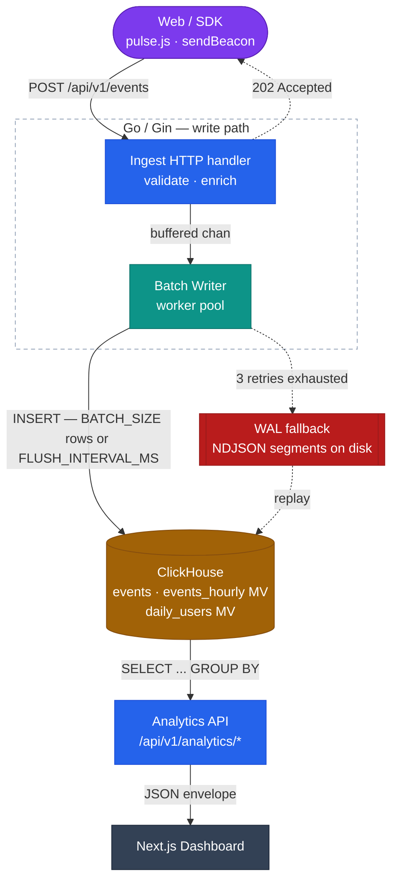
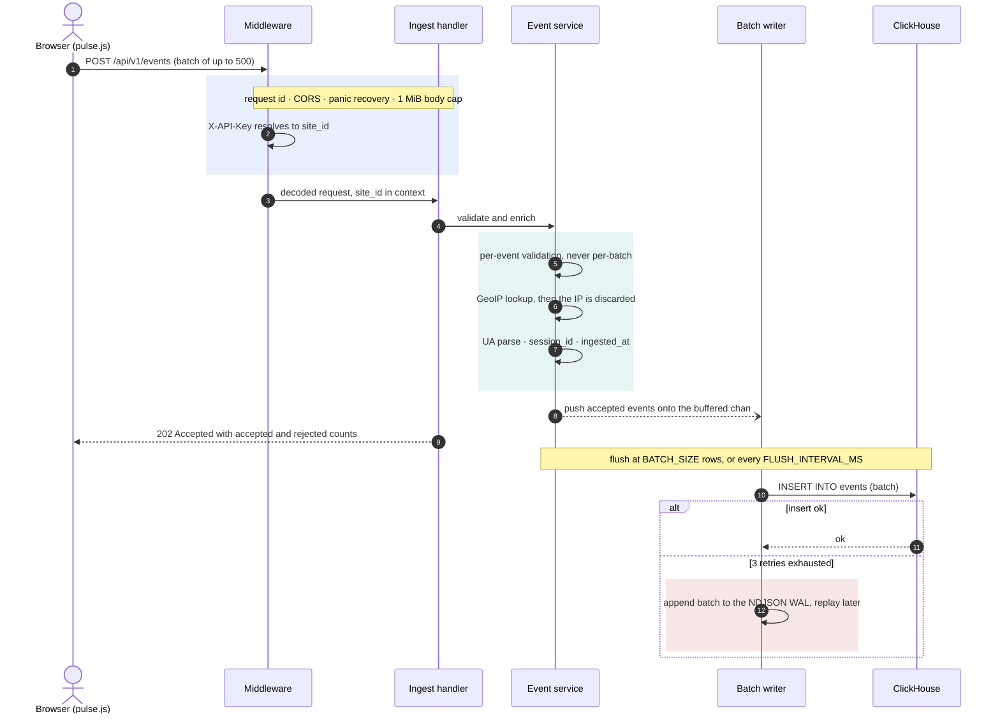
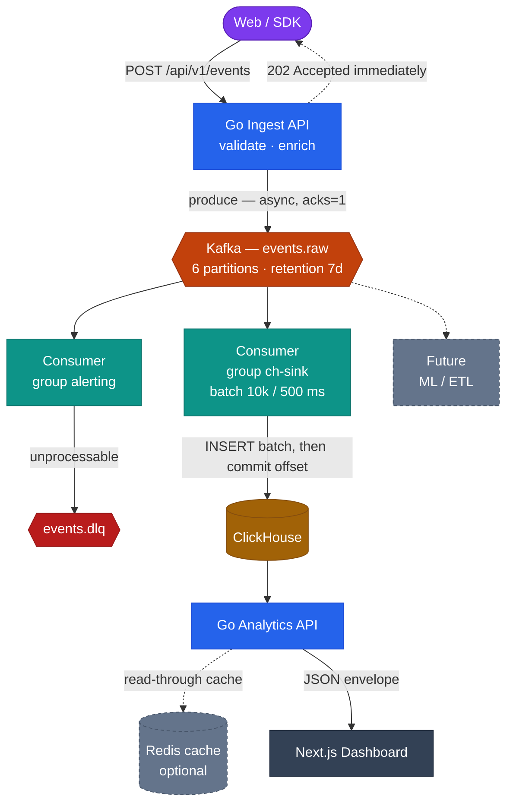
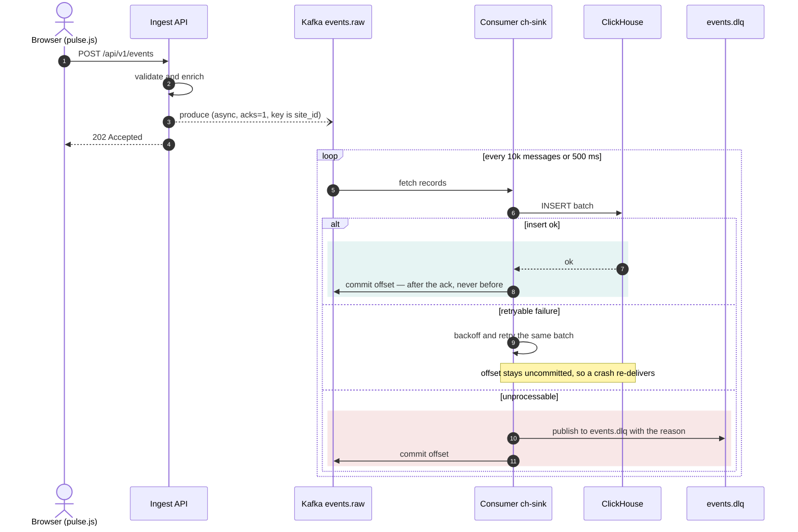
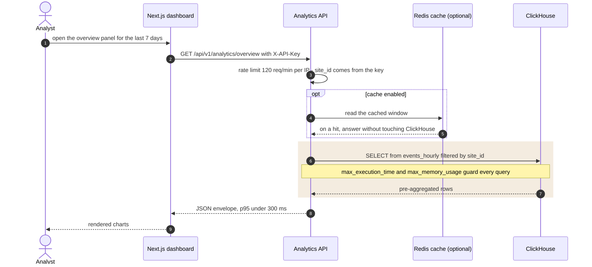

# Architecture

The system is built in two phases. Phase 1 is a monolith that writes straight to ClickHouse
and covers Levels 1 to 3. Phase 2 puts Kafka between ingest and storage and splits the
binaries; it starts at Level 4.

Both phases obey the same rule: **the ingest path never depends on ClickHouse being up.**

::: tip Reading the diagrams
Every diagram on this page is Mermaid source, rendered in the browser. Colour carries meaning:
violet is the client, blue is a Go HTTP service, teal is asynchronous processing, orange is
the message bus, amber is storage, and red is a failure path.
:::

## Phase 1 — monolith

The HTTP handler does not write to ClickHouse. It validates, enriches and pushes onto a
buffered channel, then returns `202`. A worker pool drains that channel and inserts in
batches of `BATCH_SIZE` rows or every `FLUSH_INTERVAL_MS`, whichever comes first.

When ClickHouse refuses the insert, the writer retries three times with exponential backoff
and jitter, and then writes the batch to a newline-delimited JSON write-ahead log on disk. A
replay process picks those files up later. That is what makes "kill ClickHouse for five
minutes and lose nothing" a test rather than a hope.

### One event, end to end

The dotted `202` in the diagram above is the whole point: the response leaves before the row
is stored.

Everything up to the `202` happens inside the request. Everything after it is the writer's
problem, and a slow or dead ClickHouse changes the response to the browser not at all.

## Phase 2 — event pipeline

Kafka buys three things a direct write cannot: the ingest API stops caring whether ClickHouse
is reachable, events can be replayed after a schema fix, and a second consumer group can read
the same stream without touching the write path.

The cost is at-least-once delivery. The consumer commits its offset **after** ClickHouse
acknowledges the insert, never before, so a crash re-delivers rather than loses. Duplicates
are removed at query time using `event_id`. See [ADR-0005](/adr/).

### Where the offset is committed

At-least-once is a deliberate trade: a duplicate row is cheap to remove at query time, a lost
event is not recoverable at all.

## Request lifecycle

What happens to one event, end to end:

1. **Middleware.** A UUIDv7 request id is attached (or an inbound `X-Request-ID` is reused),
   panics are converted into a `500` with the standard error envelope, CORS is applied, and
   the body size is capped at 1 MiB.
2. **Authentication.** The `X-API-Key` header resolves to a `site_id`, which is put in the
   request context. Every subsequent query is scoped by it — there are no cross-tenant reads.
3. **Validation.** Per-event, not per-batch. A batch of 100 events with 3 bad ones accepts 97
   and returns them in a `rejected` array. One malformed event never discards a batch.
4. **Enrichment.** IP address to country and city via MaxMind GeoLite2 — then the IP is
   **discarded**. User-Agent to device, OS and browser. A missing `session_id` is derived from
   a 30-minute window hash. An `ingested_at` timestamp is stamped for lag measurement.
5. **Sink.** Buffer, or Kafka producer, depending on `SINK`.
6. **Response.** `202 Accepted`, with the count of accepted events and the rejected ones.

## The read path

The write path is tuned for never losing an event. The read path is tuned for one number: a
dashboard panel that answers in under 300 ms at 100M rows.

The materialized view is what makes that number reachable: `/analytics/overview` reads
`events_hourly`, which is orders of magnitude smaller than `events`, so the query touches
hours rather than raw rows. See the [ClickHouse schema](/reference/clickhouse).

## Why ClickHouse

The workload is append-only, read-mostly-by-aggregate, and the queries all look like "group
this time range by one low-cardinality dimension". That is the shape a column store is built
for: only the columns in the query are read from disk, the compression ratio on sorted
columnar data is an order of magnitude better than row storage, and execution is vectorised.

ClickHouse is also bad at things this project does not need: point lookups by primary key,
updates and deletes, large joins, and transactions. Level 3 measures both sides of that trade
against PostgreSQL and writes the numbers down — see
[benchmark results](/notes/benchmark-results).

## Performance targets

Every one of these is verified by a test or a measurement, not asserted:

| Target | Value | Verified in |
|---|---|---|
| Dashboard query p95 at 100M events | < 300 ms | Level 5 |
| `/analytics/overview` after materialized views | < 100 ms | Level 5 |
| `/analytics/realtime` | < 200 ms | Level 5 |
| Ingest throughput | 10,000 events/s for 10 minutes, zero drops | Level 3 |
| Ingest API p99 latency | < 50 ms | Level 3 |
| End-to-end lag p99 at 5k events/s | < 5 s | Level 4 |

## Editing these diagrams

Diagrams are Mermaid fenced blocks in this file, rendered by `vitepress-plugin-mermaid`. Two
rules keep them consistent:

- **Never pin a Mermaid `theme`.** The plugin switches to the dark theme together with the
  site. Node colour comes from the `classDef` palette declared at the bottom of each
  flowchart, and those fills carry white text, so they read on either background.
- **Reuse the palette.** `client`, `api`, `proc`, `queue`, `store`, `ui`, `fallback` and
  `future` mean the same thing on every diagram in these docs. A new box picks an existing
  class instead of a new colour.

## Read more

- [ClickHouse schema](/reference/clickhouse) — tables, materialized views, why each exists
- [Event schema](/reference/event-schema) — the payload contract and validation rules
- [Architecture decisions](/adr/) — the ten decisions and their trade-offs
