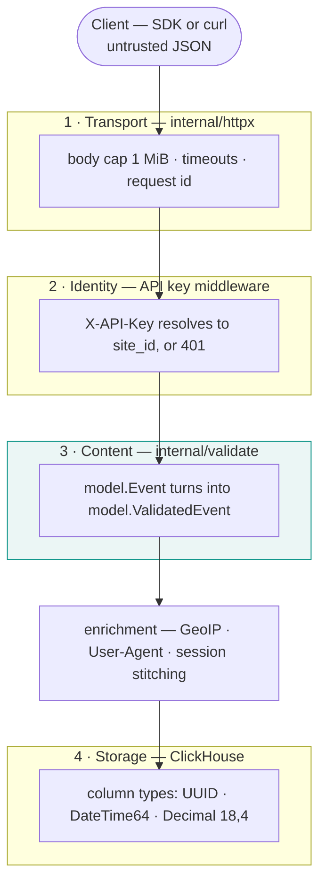
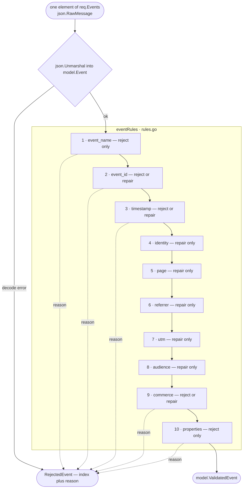
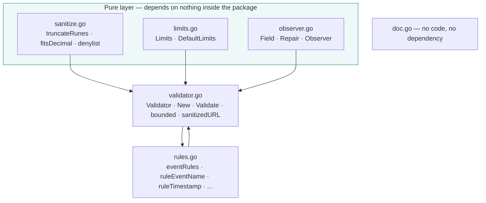
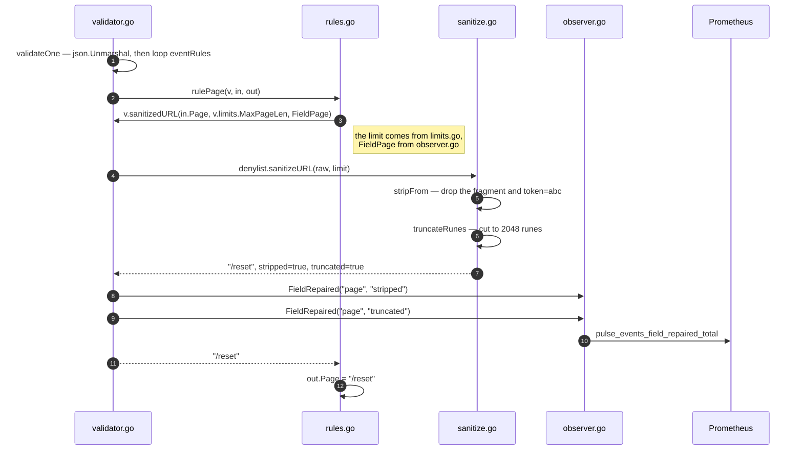

# Validation pipeline

`internal/validate` turns the events a client sends into the events this system may store.

It is **not** a general-purpose validation package. It is the ingest boundary, and its shape
follows from one product decision: a batch of 100 events with 3 bad ones must store 97 and
report 3. Everything below is a consequence of that.

The rules themselves are in the [event schema reference](/reference/event-schema). This page
is about the **code**: how the pipeline is put together, and what to do when you need to add
to it.

## Where validation sits

Four different things check an incoming request, and only one of them is this package.



| Layer | Checks | Knows nothing about |
|---|---|---|
| 1 · `httpx` | Size and time | What an event is |
| 2 · middleware | Who is calling, which site | What is in the body |
| **3 · `validate`** | **The content of each event** | That it was called over HTTP |
| 4 · ClickHouse | Column types | Which event was at fault |

Layer 4 sounds like it would be enough on its own. It is not, because **it fails silently**:
a `Decimal(18, 4)` handed a number that does not fit is truncated rather than refused, and a
revenue total that is quietly wrong is worse than a rejected event, because nobody audits a
number that looks plausible.

The principle is: **fail where you can still say "event 42, field revenue".** By the time an
`INSERT` returns, that information is gone.

::: tip Validate at the boundary, trust inside
Nothing below layer 3 checks again. `repository` receives a `model.ValidatedEvent` and inserts
it — there is no second `if len(page) > 2048`.

That is not laziness; it is the reason two types exist. Only `internal/validate` can construct
a populated `ValidatedEvent`, so the compiler guarantees what a convention would only ask for.
Re-checking downstream means you do not trust your own types.
:::

## Two classes of fault

Read [PLAN.md §5.2](https://github.com/nxhawk/Real-time-Web-Analytics-Platform/blob/main/PLAN.md)
carefully and it splits in two. This split is the single most important thing to understand
before touching the package.

| | **Reject** | **Repair** |
|---|---|---|
| What it means | The client sent something it generates itself, and got it wrong | Circumstances the visitor did not choose |
| Examples | `event` is not snake_case, `properties` is an array, `revenue` overflows the column | A device with a wrong clock, a `user_id` longer than the column, a URL carrying `?token=` |
| The rule does | `return model.ReasonXxx` | Fixes the value, calls `observer.FieldRepaired(...)` |
| Cost | One event, and the client is told why | Nothing — the event is stored |

Picking the wrong side is a worse mistake than writing ugly code:

- **Rejecting what should be repaired** throws away real traffic. A visitor whose laptop clock
  is two days fast is a real visitor.
- **Repairing what should be rejected** corrupts the numbers silently, and an SDK bug ships for
  months because nothing ever complained.

Why this cannot be expressed with struct tags, and why `go-playground/validator/v10` was
dropped, is [ADR-0011](/adr/0011-hand-written-event-validation).

## The pipeline

One element of `req.Events` goes through this. Rules run **in order**, and a rule may assume
every earlier rule has already run.



Two details in that diagram carry weight.

**The element is decoded here, not with the envelope.** `IngestRequest.Events` is
`[]json.RawMessage`, so `json.Unmarshal` runs once per element. Decoding the whole batch into
`[]model.Event` would make one malformed element fail all 100, and `encoding/json` cannot say
which one it was. Partial success is a property of how the request is *parsed*, not of any
validator.

**The first rejecting rule ends the event.** There is no "collect all faults for this event"
— the contract is `{index, reason}`, one reason. Collecting more would mean a different API
shape.

## How the package is put together

Six files, six responsibilities.

| File | Role | Analogy |
|---|---|---|
| `doc.go` | Package documentation, no code | The notice on the workshop door |
| `limits.go` | Every threshold | The spec sheet |
| `sanitize.go` | Pure string and URL helpers | The toolbox |
| `observer.go` | The vocabulary for reporting | The indicator panel |
| `rules.go` | One function per field group | The process sheet |
| `validator.go` | State plus orchestration | The line and its supervisor |



The three pure files **do not know about each other and do not know `Validator` exists**.
`validator.go` is the only place aware of all three. `sanitize.go` in particular imports
neither `model` nor anything to do with metrics — it takes a string and returns a string.

`rules.go` and `validator.go` reference each other, which is fine inside one package and is
deliberate: the machine and the process running on the machine are separate files but one unit.

### Following one value through

Take `page = "/reset?token=abc#top"`, 3000 characters long.



Steps 5 to 10 are the reason `sanitize.go` and `validator.go` are separate files.
`sanitize.go` only **reports the truth** — was anything stripped, was anything cut. Turning
that truth into a metric call belongs to `validator.go`.

If `truncateRunes` reported its own metrics it would need two extra parameters purely to do so,
a string-cutting function would depend on Prometheus, and `TestTruncateRunes` would have to
build a whole `Validator` just to check that `"abcdef"` becomes `"abcde"`.

### One-line summary per file

- `doc.go` — **why**
- `limits.go` — **how much**
- `sanitize.go` — **how**, in pure functions
- `observer.go` — **what words** the reporting uses
- `rules.go` — **which field, which rule**
- `validator.go` — **who holds the state and drives it**

## Checklist: adding a new rule

Work through this in order. Steps 1 and 2 are decisions; the rest is mechanical.

### 1 · Decide reject or repair

Ask: *is this a bug in something the client generates, or a circumstance the visitor did not
choose?* See [Two classes of fault](#two-classes-of-fault). Do not skip this — it determines
half the steps below.

### 2 · Decide whether it belongs here at all

`internal/validate` is the **ingest write path**. A model that is not an event usually belongs
somewhere else — see [Validation for something that is not an event](#validation-for-something-that-is-not-an-event).

### 3 · The checklist

- [ ] **`model/event.go`** — add the field to `Event` (loose: `string`, `json.Number`,
      `json.RawMessage`) and to `ValidatedEvent` (strict: the exact type the column wants)
- [ ] **A migration**, if the field needs a new ClickHouse column. `ValidatedEvent` must match
      the DDL one for one or the repository will `Append` into the wrong column
- [ ] **`validate/limits.go`** — add the threshold to `Limits`, to `DefaultLimits()`, **and one
      line to `withDefaults()`**. Forgetting the third is the usual mistake: the limit silently
      stays zero
- [ ] **`PHASES.md` §2.3** — if the number appears anywhere else too, change it there *first*,
      then propagate (CLAUDE.md §5)
- [ ] **`validate/observer.go`** — add a `Field` constant, if the rule repairs anything
- [ ] **`model/reason.go`** — add the `RejectReason` **and** a line in the `rejectReasons`
      slice, if the rule rejects. Missing the slice makes `Valid()` return false and
      `TestRejectReasonValid` fail
- [ ] **`validate/rules.go`** — write `ruleXxx`, then add **one line** to `eventRules` in the
      position it should run
- [ ] **`validate/rules_test.go`** — add an accessor and at least one case with
      `rule: "<new name>"`. Not optional: `TestEveryRuleHasACase` fails without it
- [ ] **`docs/reference/event-schema.md`** and its `docs/vi/` mirror — add the row to the
      reject or the repair table
- [ ] **`make check`** — zero findings, and `go test ./internal/model/... ./internal/validate/...`
      still over 85% coverage

### 4 · Worked example

Suppose the payload gains `"language": "vi"` and the table gains a
`language LowCardinality(String)` column.

**`model/event.go`**

```go
type Event struct {
    // ...
    Language string `json:"language,omitempty"`
}

type ValidatedEvent struct {
    // ... in the audience group, in DDL column order
    Language string // ISO 639-1, lower case; empty until enrichment fills it
}
```

**`validate/observer.go`**

```go
const (
    // ...
    FieldLanguage Field = "language"
)
```

**`validate/rules.go`**

```go
// ruleLanguage normalises the visitor's language tag.
//
// Repaired rather than rejected: the tag is a browser hint, not something the visitor typed,
// and clearing an unknown one is what gives Accept-Language enrichment its chance at it.
func ruleLanguage(v *Validator, in *model.Event, out *model.ValidatedEvent) model.RejectReason {
    lang := strings.ToLower(strings.TrimSpace(in.Language))
    if lang != "" && !isLowerAlpha(lang, 2) {
        lang = ""
        v.observer.FieldRepaired(string(FieldLanguage), string(RepairStripped))
    }

    out.Language = lang
    return model.ReasonNone
}
```

and one line in the registry:

```go
var eventRules = []eventRule{
    // ...
    {"audience", ruleAudience},
    {"language", ruleLanguage}, // [!code ++]
    {"commerce", ruleCommerce},
}
```

**`validate/rules_test.go`**

```go
language := func(e model.ValidatedEvent) any { return e.Language }

// --- language ---------------------------------------------------------
{
    name:  "a language tag is lower-cased",
    rule:  "language",
    event: model.Event{Event: "page_view", Language: "VI"},
    field: language, want: "vi",
},
{
    name:  "a tag that is not ISO 639-1 is cleared for enrichment",
    rule:  "language",
    event: model.Event{Event: "page_view", Language: "vietnamese"},
    field: language, want: "",
    repairs: []string{"event_id:defaulted", "language:stripped", "timestamp:defaulted"},
},
```

::: warning `repairs` is compared sorted, and includes the defaults
An event that omits `event_id` and `timestamp` always produces `event_id:defaulted` and
`timestamp:defaulted`, so a case that asserts `repairs` has to list them too, in alphabetical
order. Set `repairs: nil` to skip the check when the case is not about repairs.
:::

If the rule **rejects** instead, add the reason in both places:

```go
// model/reason.go
const (
    // ...
    ReasonInvalidLanguage RejectReason = "invalid_language"
)

var rejectReasons = []RejectReason{
    // ...
    ReasonInvalidLanguage, // [!code ++]
}
```

and the test case only needs `reason`:

```go
{
    name:   "an unknown language tag is rejected",
    rule:   "language",
    event:  model.Event{Event: "page_view", Language: "vietnamese"},
    reason: model.ReasonInvalidLanguage,
},
```

### 5 · Smaller changes

**Changing a threshold** — edit `DefaultLimits()`, but change
[`PHASES.md` §2.3](https://github.com/nxhawk/Real-time-Web-Analytics-Platform/blob/main/PHASES.md)
first, then propagate to `PLAN.md` §5.2 and to both event-schema pages.

**Adding a denylist parameter** — no code change. A universal name
(`session_token`) goes in `builtinSensitiveParams` in `sanitize.go`; anything specific to one
deployment goes in `SENSITIVE_QUERY_PARAMS`, which needs no redeploy. See
[Configuration](/guide/configuration).

**Adding a pure helper** — write it in `sanitize.go` with no `*Validator` receiver and no
`Observer`, then test it directly in `sanitize_test.go`. Far cheaper than reconstructing a
whole event to reach it.

### Three things not to do

- **Do not call `metrics.` from a rule.** Go through `v.observer`. A rule that imports
  Prometheus is a rule whose tests can no longer use `t.Parallel()`.
- **Do not hard-code a number in a rule.** `if len(x) > 128` must be
  `v.limits.MaxUserIDLen`. Thresholds are data.
- **Do not call `time.Now()` directly.** Use `v.now()`, or the clock-skew tests become a race
  against the wall clock instead of a fixed input.

## Validation for something that is not an event

Most new models do **not** belong in `internal/validate`. What decides is the *shape of the
error*, not whether the word "validation" applies.

| The model belongs to | Example | Validation lives in | Error shape |
|---|---|---|---|
| The write path | `Session` (L3), a DLQ entry (L4) | `internal/validate` | Partial success — `{index, reason}` |
| Query parameters | `TimeRange`, `PagesQuery` (L1.5) | parsing in `handler/`, the rule in `service/` | All or nothing — `400 invalid_range` |
| Configuration or admin | `Site`, `ApiKey` | `service/` | Per field — `details: {field: code}` |

`Result{Accepted, Rejected}` only means something when you process a **batch** and one bad
element must not cost the rest. That is specific to event ingest. A `TimeRange` has no partial
success: `from > to` and the whole request is wrong.

Two notes for when that day comes:

- **Rename first.** `validate.Validator` and `validate.New` currently claim generic names for
  the event path. The moment a second write-path model arrives they should become
  `validate.EventValidator` and `validate.NewEventValidator`. Cheap now, expensive later.
- **Reuse `sanitize.go`, not `Validator`.** The pure helpers work for any model — that is the
  payoff of having kept them free of receivers and observers. `Limits` and `RejectReason` are
  event-specific; `RejectReason` in particular is both an API contract and a Prometheus label.

## See also

- [Event schema](/reference/event-schema) — the rules themselves, field by field
- [ADR-0011](/adr/0011-hand-written-event-validation) — why the rules are hand-written
- [Configuration](/guide/configuration) — `ingest.sensitive_query_params`
- [Project structure](/guide/project-structure) — where each package sits
