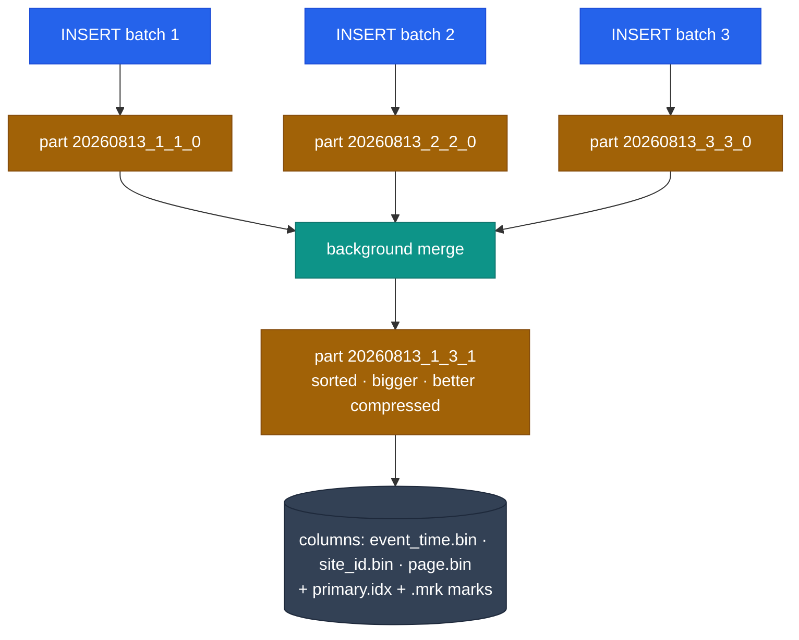

# ClickHouse explained

<Badge type="tip" text="Knowledge" />

This page is the long explanation that [ClickHouse schema](/reference/clickhouse) deliberately
skips. That page says *what* this project's schema is; this one says *what ClickHouse is*, why
it behaves the way it does, and how to decide between it, PostgreSQL and Elasticsearch.

Read it once end to end, then come back to individual sections. Nothing here is specific to
Pulse Analytics until the [last section](#how-pulse-analytics-uses-all-of-this).

::: tip The one-paragraph version
ClickHouse is a column-oriented OLAP database. It stores each column in its own file, sorted by
a key you choose, compressed hard, and reads only the columns and only the row ranges a query
actually needs. That makes aggregations over billions of rows fast and cheap. In exchange it
gives up nearly everything a transactional database does for you: no real transactions, no
foreign keys, no unique constraints, no cheap single-row update, and eventual — not
immediate — deduplication. It is a database for questions about *many rows*, not for
storing *one row* correctly.
:::

## Part 1 — What ClickHouse actually is

### OLTP vs OLAP

Two workloads, two shapes of database.

| | OLTP (PostgreSQL, MySQL) | OLAP (ClickHouse, BigQuery, Druid) |
|---|---|---|
| Typical query | `SELECT * FROM users WHERE id = 42` | `SELECT country, count() FROM events WHERE day > … GROUP BY country` |
| Rows touched | 1 to a few hundred | millions to billions |
| Columns touched | most of the row | 2 to 5 out of 50 |
| Writes | many small, transactional | few huge batches, append-only |
| Optimised for | correctness of a single record | throughput over a set of records |
| Latency budget | 1 ms | 100 ms — 10 s |

A dashboard asking "sessions per day per country for the last 90 days" is the OLAP shape. A
checkout flow debiting a wallet is the OLTP shape. Every design difference below follows from
this split.

### Column-oriented storage

A row store keeps a record's fields next to each other on disk. A column store keeps each
column's values next to each other instead.

```text
Row store (PostgreSQL heap page)
  [1|/home|VN|Chrome|2026-08-13] [2|/pricing|US|Safari|2026-08-13] [3|/home|VN|Firefox|…]
  → reading `country` still pulls every other field into memory with it

Column store (ClickHouse part)
  id      : [1, 2, 3, …]              → id.bin
  page    : [/home, /pricing, /home]  → page.bin
  country : [VN, US, VN, …]           → country.bin
  browser : [Chrome, Safari, Firefox] → browser.bin
  → `SELECT country, count() … GROUP BY country` opens exactly one file
```

Three consequences, and they are the whole story:

1. **You only pay for the columns you name.** This is why `SELECT *` on a wide table in
   ClickHouse is not a small sin — it is often a 10× slowdown. Always list columns.
2. **Compression gets dramatically better.** Neighbouring values in a column are similar —
   the same 200 country codes, timestamps a few seconds apart, a handful of browser names.
   10× to 30× compression is routine, versus roughly 2× to 4× for a row store. Less data on
   disk means less I/O, which is the actual reason queries are fast.
3. **Single-row work becomes expensive.** Updating one field of one row means rewriting a
   chunk of a column file. That is why ClickHouse treats updates as a rare, asynchronous,
   heavyweight operation and PostgreSQL treats them as the normal case.

### Vectorized execution

ClickHouse does not process a row at a time. It pulls a block of ~65k values out of a column
and runs the operation over the whole block, which keeps the CPU's SIMD units and cache busy
instead of paying interpreter overhead per row. Combined with per-query multithreading — one
query saturates every core on the machine — this is the second half of the speed story.

You do not configure any of it, but it explains a recurring surprise: a query over 100M rows
can be *faster* than a query over 1M rows on a row-store database, and adding a second
`GROUP BY` column often costs almost nothing while adding a `JOIN` costs a great deal.

### Where ClickHouse sits

- **Single node scales further than people expect.** One machine with plenty of cores and NVMe
  comfortably serves tens of billions of rows. Reach for a cluster because of ingest volume,
  HA requirements or data size — not reflexively.
- **Clustering is explicit, not automatic.** Sharding and replication are things you configure
  (`ReplicatedMergeTree`, a `Distributed` table, ClickHouse Keeper), not things you get for
  free. See [Replication and sharding](#replication-and-sharding-in-one-page).

## Part 2 — The concepts, one by one

### Table engines

The engine decides how a table stores data and what happens on merge. Everything else is
detail.

| Family | Engines | Use for |
|---|---|---|
| **MergeTree** | `MergeTree`, `ReplacingMergeTree`, `SummingMergeTree`, `AggregatingMergeTree`, `CollapsingMergeTree`, `VersionedCollapsingMergeTree`, and each with a `Replicated` prefix | 99% of real tables |
| **Log** | `TinyLog`, `StripeLog`, `Log` | tiny scratch tables, no index, no concurrency |
| **Integration** | `Kafka`, `S3`, `MySQL`, `PostgreSQL`, `MongoDB`, `URL` | reading external systems as if they were tables |
| **Special** | `Distributed`, `Memory`, `Null`, `Merge`, `Dictionary`, `View`, `MaterializedView`, `Buffer` | routing, testing, glue |

`Null` deserves a mention: it discards everything written to it, but materialized views
attached to it still fire. That is the standard trick for "transform on insert without keeping
the raw rows".

### MergeTree: parts, granules, marks, merges

This is the mental model everything else hangs off.

- An **INSERT** does not append to an existing file. It writes a brand-new **part**: a
  directory containing one `.bin` per column, sorted by the table's `ORDER BY`.
- A background thread **merges** small parts into bigger ones, keeping them sorted. This is a
  log-structured merge tree, hence the name.
- Inside a part, rows are grouped into **granules** of `index_granularity` rows (default 8192).
  The granule is the smallest unit ClickHouse will read — asking for 1 row reads 8192.
- The **primary index** stores one entry per granule (the value of the sorting key at its first
  row) in a `primary.idx` file that stays in memory. **Marks** (`.mrk`) map granule number to a
  byte offset inside each column file.



Two practical consequences:

- **Insert in large batches.** Every insert costs a part; too many parts and merges cannot keep
  up, which produces the famous `Too many parts` (error 252). Target at least 10k rows per
  insert and at most ~1 insert/second/table. If your producer cannot batch, turn on
  [async inserts](#async-inserts).
- **Everything is eventually consistent within a table.** Deduplication, summing and
  aggregation only happen when parts merge, and you cannot say when that is.

### ORDER BY — the single most important decision

In MergeTree, `ORDER BY` is the **sorting key**: the physical order of rows on disk. Unless you
declare `PRIMARY KEY` separately, it is also the primary index.

```sql
CREATE TABLE events (
    site_id     UInt32,
    event_name  LowCardinality(String),
    event_time  DateTime,
    user_id     String,
    page        String
) ENGINE = MergeTree
PARTITION BY toYYYYMM(event_time)
ORDER BY (site_id, event_name, event_time)
SETTINGS index_granularity = 8192;
```

::: warning It is not a PostgreSQL primary key
It does not enforce uniqueness. It does not prevent duplicates. Two identical rows insert
happily. It is purely "how the data is laid out", and changing it later means rebuilding the
table.
:::

**How it makes queries fast — granule skipping.** The primary index holds the sorting-key value
at the start of each granule. Given `WHERE site_id = 7 AND event_time >= '2026-08-01'`,
ClickHouse binary-searches that in-memory index, finds the granule ranges that could possibly
match, and reads only those. A 100M-row table where the filter matches 200k rows might read
~208k rows — the extra being partial granules at the edges. `EXPLAIN indexes = 1` shows exactly
how many granules were dropped.

**The prefix rule.** The index only works left to right. With `ORDER BY (site_id, event_name,
event_time)`:

| Query filter | Index usable? |
|---|---|
| `site_id = 7` | yes — first column |
| `site_id = 7 AND event_name = 'pageview'` | yes — prefix of two |
| `site_id = 7 AND event_time > …` | partly — narrows on `site_id`, then scans within |
| `event_name = 'pageview'` alone | no — full scan |
| `user_id = 'u_1'` | no — not in the key at all |

**How to choose it.**

1. Start from the queries you actually run. The column present in every `WHERE` goes first.
2. Among candidates, **lower cardinality first** — it produces longer runs of identical values,
   so the index is coarser but compression is much better.
3. Put the time column last, or near last. Range scans work naturally on the final key column.
4. Do not add columns "just in case". Every extra key column slows merges and inserts.
5. For queries that no sensible order serves (here: `user_id`), use a
   [projection](#projections) or a [skip index](#data-skipping-indexes) instead of contorting
   the key.

**It also drives compression.** Sorting by `country` puts all `VN` values adjacent, so the
codec sees a long run and encodes it in almost nothing. The same column under a different sort
order can be several times larger. Sort order is a storage decision as much as an index one.

**`PRIMARY KEY` as a shorter prefix.** You may make the index coarser than the sort order:

```sql
ORDER BY (site_id, event_name, event_time, user_id)
PRIMARY KEY (site_id, event_name)
```

The rows are still sorted by all four columns — useful for compression and for
`ReplacingMergeTree` dedup keys — but `primary.idx` only stores two, so it uses far less
memory. `PRIMARY KEY` must be a prefix of `ORDER BY`.

### index_granularity

Rows per granule; default 8192.

- **Smaller (4096)** — finer index, better for point lookups, larger mark files, more memory.
- **Larger (16384)** — coarser index, smaller marks, better for pure full scans.

There is also `index_granularity_bytes` (adaptive granularity, on by default), which shrinks
the granule when rows are large so a granule never blows past ~10 MB. Change these only with a
measurement in hand; the default is right almost always.

### PARTITION BY

Partitioning splits a table into independent directory groups. **It is not an index and it is
not how you make queries fast** — that is `ORDER BY`'s job. Partitioning exists so you can:

- `DROP PARTITION` — delete a month of data instantly, without a mutation.
- Apply TTL and storage tiering per partition.
- Let the query planner prune whole partitions on a coarse filter.
- Keep merges local — parts from different partitions never merge together.

```sql
PARTITION BY toYYYYMM(event_time)   -- good: ~dozens of partitions
PARTITION BY toDate(event_time)     -- risky: 365 partitions/year, many small parts
PARTITION BY (site_id, toDate(t))   -- usually a mistake: partition explosion
```

Rule of thumb: aim for **tens to low hundreds** of partitions per table, never thousands. Too
many partitions means too many parts, slow merges, and `Too many parts` again.

### Data-skipping indexes

A secondary index in ClickHouse does not point at rows. It stores a small summary per *N
granules* and lets the reader skip blocks that cannot match. It can only ever save I/O; it can
never make a lookup O(log n).

```sql
ALTER TABLE events
  ADD INDEX idx_user user_id TYPE bloom_filter(0.01) GRANULARITY 4,
  ADD INDEX idx_ingested ingested_at TYPE minmax GRANULARITY 1,
  ADD INDEX idx_page_tok page TYPE tokenbf_v1(4096, 3, 0) GRANULARITY 2;

-- an index only covers data written after it exists
ALTER TABLE events MATERIALIZE INDEX idx_user;
```

| Type | Stores | Good for |
|---|---|---|
| `minmax` | min and max per block | columns correlated with the sort order — `ingested_at`, an auto-increment id |
| `set(N)` | up to N distinct values per block | low-cardinality columns not in the key |
| `bloom_filter(p)` | a Bloom filter of values | high-cardinality equality — `user_id = 'u_1'` |
| `tokenbf_v1(size, hashes, seed)` | Bloom filter of word tokens | `hasToken(page, 'checkout')`, log search |
| `ngrambf_v1(n, size, hashes, seed)` | Bloom filter of n-grams | `LIKE '%substring%'` |

`GRANULARITY k` means "one index entry per k granules". Higher k = smaller index, coarser
skipping. A skip index whose column is uncorrelated with the sort order often skips nothing and
still costs disk and insert time — always verify with `read_rows` before and after.

### Projections

A projection is a second physical copy of the table, stored inside the same parts, with a
different sort order or a pre-aggregation. The optimiser picks it automatically when it helps.
This is the clean answer to "my key serves the dashboard but I also need lookups by user".

```sql
ALTER TABLE events ADD PROJECTION proj_by_user (
    SELECT * ORDER BY (user_id, event_time)
);
ALTER TABLE events MATERIALIZE PROJECTION proj_by_user;
```

Aggregating projections work too:

```sql
ALTER TABLE events ADD PROJECTION proj_country_day (
    SELECT site_id, toDate(event_time) AS d, country, count()
    GROUP BY site_id, d, country
);
```

The cost is real and must be measured: **disk grows**, **inserts slow down**, and every merge
does the work twice. Three numbers decide whether it stays — size increase, insert throughput
delta, query speedup.

### Materialized views — an insert trigger, not a cache

This is the concept that trips up everyone arriving from PostgreSQL. A ClickHouse materialized
view does **not** store a query result that gets refreshed. It is a trigger: when a block of
rows is inserted into the source table, the view's `SELECT` runs *over just that block* and
writes the result into a target table.

```sql
CREATE TABLE events_hourly (
    site_id    UInt32,
    hour       DateTime,
    country    LowCardinality(String),
    events     AggregateFunction(count),
    uniq_users AggregateFunction(uniq, String)
) ENGINE = AggregatingMergeTree
ORDER BY (site_id, country, hour);

CREATE MATERIALIZED VIEW events_hourly_mv TO events_hourly AS
SELECT
    site_id,
    toStartOfHour(event_time) AS hour,
    country,
    countState()        AS events,
    uniqState(user_id)  AS uniq_users
FROM events
GROUP BY site_id, hour, country;
```

Reading it back:

```sql
SELECT hour, countMerge(events) AS events, uniqMerge(uniq_users) AS users
FROM events_hourly
WHERE site_id = 7 AND hour >= now() - INTERVAL 7 DAY
GROUP BY hour ORDER BY hour;
```

Four things follow, and each of them has bitten someone:

- **Store state, not values.** `countState()` / `uniqState()` write a partial aggregation state
  that merges correctly when parts merge; `countMerge()` / `uniqMerge()` finish the job at read
  time. Write a plain `count()` into an `AggregatingMergeTree` and the numbers are right until
  the first merge, then silently wrong. (For simple commutative aggregates like `sum`, `min`,
  `max`, `SimpleAggregateFunction` is a cheaper alternative that needs no `-Merge`.)
- **A view only sees inserts made after it was created.** Historical data needs an explicit
  `INSERT INTO … SELECT` backfill, run month by month so it does not exhaust memory, with
  careful boundaries so nothing is double counted.
- **`GROUP BY` cardinality is the whole game.** Only low-cardinality columns belong there. Put
  `page` or `user_id` in and the "aggregate" ends up nearly as large as the raw table. Rule
  used here: if the views together exceed 15% of the raw table, the `GROUP BY` is wrong.
- **A failing view can fail your insert.** Errors propagate back to the writer by default.

ClickHouse also has **refreshable materialized views** (`REFRESH EVERY 1 HOUR`), which are the
PostgreSQL-style periodic recompute — useful when the query cannot be expressed incrementally.

### The specialised MergeTree engines

All of them do their work **during merges**, which means the effect is eventually visible, not
immediately.

| Engine | Behaviour on merge | Use for |
|---|---|---|
| `ReplacingMergeTree(ver)` | keeps one row per sorting key — the largest `ver` | dimension tables, upserts, last-known state |
| `SummingMergeTree(cols)` | sums the numeric columns for equal sorting keys | simple counters |
| `AggregatingMergeTree` | merges `AggregateFunction` states | materialized view targets |
| `CollapsingMergeTree(sign)` | cancels a `+1` row against a `-1` row | mutable rows without updates |
| `VersionedCollapsingMergeTree(sign, ver)` | same, tolerant of out-of-order arrival | the same, over a message queue |

```sql
CREATE TABLE user_first_seen (
    site_id    UInt32,
    user_id    String,
    first_seen DateTime
) ENGINE = ReplacingMergeTree(first_seen)
ORDER BY (site_id, user_id);
```

`SELECT … FINAL` forces the collapse at read time so you see the deduplicated view immediately.
It is also **very** expensive, because it has to merge all matching parts on the fly. Never put
`FINAL` on a hot dashboard path; design so you do not need it, or use
`argMax(value, version)` in the query instead.

### Types that matter

| Type | Why it matters |
|---|---|
| `LowCardinality(String)` | dictionary-encodes a column with few distinct values. Massive size and `GROUP BY` win under roughly 10k distinct values; a *loss* above ~100k |
| `Nullable(T)` | stores a separate null bitmap, blocks several optimisations, and cannot be in a key cheaply. Prefer `T` with a sentinel default |
| `Enum8` / `Enum16` | fixed set validated at write time; stored as an integer |
| `DateTime` vs `DateTime64(3)` | seconds vs milliseconds. Never store local time — store UTC and convert with `toTimeZone()` at read |
| `UInt8` as boolean | there is no `Boolean` type worth using |
| `Array(T)`, `Map(K,V)`, `Tuple`, `Nested` | first-class nested data, queried with `arrayJoin`, `has()`, higher-order functions |
| `JSON` | the modern dynamic-column type; it materialises sub-paths as real columns under the hood |
| `UUID`, `IPv4`, `IPv6` | fixed-width, far smaller than the string form |
| `Decimal(P,S)` | when float rounding is unacceptable — money |

### Codecs and compression

Compression is chosen per column, and pairing a *transform* codec with a general one is where
the wins are:

```sql
event_time   DateTime  CODEC(Delta, ZSTD(1)),      -- monotonic → tiny deltas
sequence_id  UInt64    CODEC(DoubleDelta, ZSTD(1)),-- near-constant increments
duration_ms  UInt32    CODEC(T64, ZSTD(1)),        -- small ints, bit-packed
page         String    CODEC(ZSTD(1)),             -- text
sampled_rate Float64   CODEC(Gorilla, ZSTD(1))     -- slowly-changing floats
```

`LZ4` (the default) is fastest to decompress; `ZSTD(1)` is a good hot-data default; `ZSTD(9+)`
is for cold data you rarely read. Check the result rather than trusting the theory:

```sql
SELECT column,
       formatReadableSize(sum(column_data_compressed_bytes))   AS compressed,
       formatReadableSize(sum(column_data_uncompressed_bytes)) AS uncompressed,
       round(sum(column_data_uncompressed_bytes)
           / sum(column_data_compressed_bytes), 2)             AS ratio
FROM system.parts_columns
WHERE active AND table = 'events'
GROUP BY column ORDER BY sum(column_data_compressed_bytes) DESC;
```

### TTL — data lifecycle as a table property

```sql
ALTER TABLE events MODIFY TTL
    event_time + INTERVAL 30 DAY RECOMPRESS CODEC(ZSTD(9)),
    event_time + INTERVAL 90 DAY TO VOLUME 'cold',
    event_time + INTERVAL 180 DAY DELETE;
```

TTL can also **aggregate on expiry** — keep raw rows for a week, then roll them up in place:

```sql
TTL event_time + INTERVAL 7 DAY
    GROUP BY site_id, toStartOfDay(event_time)
    SET hits = sum(hits);
```

And it can apply to a single column (`page String TTL event_time + INTERVAL 30 DAY`), blanking
it while keeping the row. There is no equivalent in PostgreSQL short of a cron job plus
`pg_partman`.

### Mutations and deletes

`ALTER TABLE … UPDATE` and `ALTER TABLE … DELETE` exist, but they are **mutations**: an
asynchronous background job that rewrites every affected part. They are not transactions, they
are not instant, and they are not for regular use.

```sql
ALTER TABLE events DELETE WHERE site_id = 9;     -- rewrites parts, async
SELECT * FROM system.mutations WHERE is_done = 0;

DELETE FROM events WHERE site_id = 9;            -- lightweight delete: marks rows, still not free
```

If your design needs frequent row updates, the design is wrong for ClickHouse — model it as
append-plus-`ReplacingMergeTree`, or keep that data in PostgreSQL.

### Query features you will miss elsewhere

**Combinators** — suffixes that modify any aggregate function, composable:

```sql
SELECT
    countIf(event_name = 'purchase')                AS purchases,   -- -If
    uniqExactIf(user_id, country = 'VN')            AS vn_users,
    sumArray(item_prices)                           AS revenue,     -- -Array
    quantilesTDigest(0.5, 0.95, 0.99)(duration_ms)  AS p50_p95_p99,
    avgMerge(avg_state)                             AS avg_final    -- -Merge
FROM events;
```

**Approximate aggregates** — `uniq` (HyperLogLog-ish, ~0.5% error, cheap) vs `uniqExact`
(correct, memory-hungry); `quantileTDigest` vs `quantileExact`. Choosing approximation
deliberately is normal here, not a hack.

**`PREWHERE`** — read the filter column first, then only fetch other columns for surviving
rows. Usually automatic, worth forcing on a cheap filter over a wide table.

**Array and higher-order functions** — `arrayJoin`, `arrayMap`, `arrayFilter`, `groupArray`,
`arrayEnumerate`. Funnel and retention analysis is built on these:

```sql
SELECT windowFunnel(3600)(event_time,
         event_name = 'view', event_name = 'add_to_cart', event_name = 'purchase') AS step
FROM events GROUP BY user_id;

SELECT retention(day = '2026-08-01', day = '2026-08-02', day = '2026-08-08') FROM daily;
```

**Table functions** — query things that are not tables:

```sql
SELECT * FROM s3('https://bucket/events/*.parquet', 'Parquet') LIMIT 10;
SELECT * FROM url('https://example.com/data.csv', CSV);
SELECT * FROM postgresql('host:5432', 'db', 'sites', 'user', 'pass');
SELECT * FROM file('local.ndjson', JSONEachRow);
```

**Dictionaries** — small reference data held in memory and looked up with `dictGet()` instead
of a join. This is the idiomatic replacement for a star-schema dimension join.

### Async inserts

When you genuinely cannot batch on the client (many small writers, per-request inserts), let
the server batch for you:

```sql
INSERT INTO events SETTINGS async_insert = 1, wait_for_async_insert = 1 VALUES …;
```

The server buffers rows in memory and flushes on size or time. `wait_for_async_insert = 0` is
faster but means an accepted insert can still be lost. A batching writer in your application is
still better, because it also gives you retries and backpressure.

### Replication and sharding, in one page

- **Replication** is per table: use `ReplicatedMergeTree`, coordinated by ClickHouse Keeper
  (or ZooKeeper). Replicas exchange parts, and inserts are deduplicated by block checksum — so
  a retried insert of the same block does not double count. This is the *only* built-in
  idempotency you get.
- **Sharding** is manual: create the local table on every node, then a `Distributed` table that
  fans queries out and merges results. You pick the sharding key.
- `ON CLUSTER` runs DDL everywhere at once.
- Clickhouse Cloud and some setups separate storage and compute (shared object storage), which
  changes the operational picture but not the query model.

### Introspection

ClickHouse is unusually transparent about itself; `system` tables are the debugging tool.

```sql
-- what a query actually did
SELECT query_duration_ms, read_rows, read_bytes,
       formatReadableSize(memory_usage), substring(query, 1, 120)
FROM system.query_log
WHERE type = 'QueryFinish' AND event_time > now() - INTERVAL 1 HOUR
ORDER BY query_duration_ms DESC LIMIT 20;

-- parts and sizes
SELECT table, count() AS parts, sum(rows),
       formatReadableSize(sum(bytes_on_disk)) AS size
FROM system.parts WHERE active AND database = 'analytics' GROUP BY table;

-- did the index help?
EXPLAIN indexes = 1
SELECT count() FROM events WHERE site_id = 7 AND event_time > now() - INTERVAL 1 DAY;

-- how parallel was it?
EXPLAIN PIPELINE SELECT count() FROM events;
```

## Part 3 — When to use ClickHouse, and when not to

### Reach for it when

- **Analytical queries over a large, append-only dataset.** Events, clickstream, logs, metrics,
  traces, IoT readings, ad impressions, financial ticks.
- **The data is written once and read many times, aggregated.** No per-row edits after the
  fact.
- **Ingest is high and bursty.** Hundreds of thousands of rows per second on one node is normal.
- **Storage cost matters.** 10–30× compression on real event data changes the budget.
- **A user-facing dashboard needs sub-second aggregates** over data that PostgreSQL would need
  minutes for.
- **The query shape is known in advance**, so you can pick a sort order that serves it.

### Avoid it when

- **You need transactions.** No multi-statement ACID, no rollback, no `SELECT … FOR UPDATE`.
- **You need constraints.** No foreign keys, no unique constraints, no check constraints worth
  the name. The database will not protect your data model for you.
- **Rows change often.** Updates and deletes are asynchronous part rewrites.
- **The workload is point lookups by primary key.** ClickHouse can do it, but PostgreSQL,
  Redis or a KV store will do it in a fraction of the latency, at a fraction of the complexity.
- **You need high-concurrency small queries.** ClickHouse is built for a few big queries using
  all cores, not thousands of concurrent tiny ones. A hundred concurrent queries is already a
  lot.
- **The dataset is small.** Under a few million rows, PostgreSQL with a good index is simpler
  and just as fast. Do not add an OLAP database to solve a problem an index solves.
- **You need real full-text search with relevance ranking.** That is Elasticsearch's job.

::: tip The pragmatic answer for most products
Both. PostgreSQL owns users, sites, API keys, billing, configuration — anything where
correctness of a single row matters. ClickHouse owns the event stream. That is exactly the
split this project uses.
:::

## Part 4 — ClickHouse vs PostgreSQL

### What PostgreSQL has that ClickHouse does not

| Capability | PostgreSQL | ClickHouse |
|---|---|---|
| ACID transactions, `BEGIN`/`COMMIT`/`ROLLBACK` | full, MVCC, isolation levels | none across statements. A single insert is atomic per block, that is all |
| Foreign keys | enforced | not supported |
| `UNIQUE` constraint / true primary key | enforced | not supported — `ORDER BY` does not deduplicate |
| `CHECK`, `NOT NULL` semantics | enforced | constraints exist but are checked only on insert and rarely used |
| Efficient `UPDATE` / `DELETE` of a row | the normal case | async mutation, rewrites parts |
| `INSERT … ON CONFLICT DO UPDATE` (upsert) | yes | no — approximate with `ReplacingMergeTree` |
| Point lookup latency | sub-millisecond with a B-tree | milliseconds to tens, reads whole granules |
| Row-level locking, `SELECT FOR UPDATE` | yes | no |
| Triggers, stored procedures, `LISTEN`/`NOTIFY` | yes | no (materialized views are the only "trigger") |
| Concurrency | thousands of connections | dozens of heavy queries |
| Rich `JOIN` planner | mature cost-based optimiser, hash/merge/nested-loop, good with many tables | joins work, but big-to-big joins are weak; the right hand side is loaded into memory |
| Correlated subqueries, recursive CTEs | yes | limited |
| Row-level security | yes | no equivalent |
| Point-in-time recovery, WAL streaming | yes | backups, replicas, but no PITR in the same sense |
| Extension ecosystem | PostGIS, `pgvector`, TimescaleDB, `pg_cron`, FDWs | narrow |
| ORM / tooling support | universal | partial, and [we deliberately avoid ORMs](/adr/0001-no-orm) anyway |
| Schemaless-ish `JSONB` with GIN indexes | mature | `JSON` type is newer; `Map` covers many cases |

### What ClickHouse has that PostgreSQL does not

| Capability | ClickHouse | PostgreSQL |
|---|---|---|
| True columnar storage | native | heap is row-based; columnar only via extensions |
| Compression ratio on event data | 10–30× | 2–4× |
| Vectorized, multi-core execution of a single query | always | one core per query by default, limited parallel workers |
| Sparse primary index over sorted data | yes, and it is the default model | B-tree over unsorted heap; `CLUSTER` is a one-off |
| Incremental materialized views (insert triggers) | yes | only `REFRESH MATERIALIZED VIEW`, a full recompute |
| Aggregate states that merge (`-State` / `-Merge`) | yes | no equivalent |
| Data-skipping indexes (bloom, tokenbf, minmax) | yes | partly — BRIN is the closest |
| Projections (alternate sort orders inside the table) | yes | no |
| TTL: delete, recompress, move to cold storage, roll up | declarative on the table | cron plus partitioning |
| Aggregate combinators (`-If`, `-Array`, `-Merge`, `-Resample`) | yes | `FILTER (WHERE …)` only |
| Approximate aggregates (`uniq`, `quantileTDigest`) | first class | extensions only |
| `SAMPLE 0.1` on a sampling key | built in | `TABLESAMPLE`, coarser |
| Array / higher-order / funnel / retention functions | extensive (`windowFunnel`, `retention`, `sequenceMatch`) | limited |
| Ingest throughput | hundreds of thousands of rows/s per node | tens of thousands, with tuning |
| Query external systems as tables | `s3()`, `url()`, `Kafka` engine, `MySQL`, `PostgreSQL` | FDWs, heavier |
| Dictionaries held in RAM with `dictGet()` | yes | no direct equivalent |

### Same query, both engines

```sql
-- PostgreSQL: correct, and painful past ~50M rows
SELECT date_trunc('hour', event_time) AS h, country, count(*), count(DISTINCT user_id)
FROM events
WHERE site_id = 7 AND event_time >= now() - interval '30 days'
GROUP BY 1, 2 ORDER BY 1;

-- ClickHouse: same intent, reads only 4 columns and only matching granules
SELECT toStartOfHour(event_time) AS h, country, count(), uniq(user_id)
FROM events
WHERE site_id = 7 AND event_time >= now() - INTERVAL 30 DAY
GROUP BY h, country ORDER BY h;

-- ClickHouse with a materialized view: reads a table thousands of times smaller
SELECT hour AS h, country, countMerge(events), uniqMerge(uniq_users)
FROM events_hourly
WHERE site_id = 7 AND hour >= now() - INTERVAL 30 DAY
GROUP BY h, country ORDER BY h;
```

::: info What about TimescaleDB?
TimescaleDB is PostgreSQL with automatic time partitioning, compression and continuous
aggregates. It is a real middle ground: you keep transactions, foreign keys and the whole
PostgreSQL ecosystem, and get a large fraction of the analytics performance. Choose it when the
dataset is in the low billions and staying on one engine is worth more than raw speed; choose
ClickHouse when analytics scale and compression are the point.
:::

## Part 5 — ClickHouse vs Elasticsearch

The two overlap because both are used for logs and both aggregate. They are built on opposite
data structures: **Elasticsearch indexes documents into an inverted index; ClickHouse sorts and
compresses columns.**

| | ClickHouse | Elasticsearch |
|---|---|---|
| Core structure | sorted, compressed columns + sparse index | inverted index + doc values per field |
| Data model | strict schema, SQL types | JSON documents, dynamic mapping |
| Query language | SQL (plus its own dialect extensions) | Query DSL (JSON); ES-QL and SQL modes exist but are secondary |
| Full-text search, relevance ranking | tokens and n-gram skip indexes only, no BM25 scoring | its reason for existing — analyzers, BM25, fuzzy, synonyms, multilingual |
| Aggregations over billions of rows | very fast, and cheap in RAM | works, but memory-hungry and slows sharply at scale |
| Storage footprint for the same logs | roughly 3–10× smaller | index plus doc values plus `_source` is heavy |
| Ingest cost per row | low — mostly sorting and compressing | high — analysis and indexing per field |
| Update / delete a single document | painful | supported (rewrite the doc) |
| Schema flexibility | `ALTER TABLE`, or the `JSON` type | add a field and it just works — until a mapping explosion |
| Joins | limited but present | essentially none (`nested`, `parent/child` only) |
| Real-time visibility of writes | after the insert commits | after refresh, typically ~1 s |
| Cluster operations | explicit, fewer moving pieces | shards, replicas, hot/warm/cold, ILM — powerful and fiddly |
| Ecosystem | Grafana, BI tools, Metabase, Superset | Kibana, Beats, Logstash, the whole ELK toolchain |
| Typical cost at high log volume | markedly lower | markedly higher |

**Choose Elasticsearch when** the question is *"find me the documents matching this text"* —
site search, product search, log search by free-text substring, anything needing relevance
scoring, fuzzy matching, stemming, or per-document updates.

**Choose ClickHouse when** the question is *"count, sum, and group these records"* — dashboards,
metrics, funnels, retention, and log *analytics* where you filter on structured fields far more
often than you grep for arbitrary text.

**Both is a legitimate architecture**: ClickHouse for the metrics and the long retention tier,
Elasticsearch (or an OpenSearch/Loki equivalent) for the searchable recent window. Many teams
have gone the other way and replaced an ELK stack with ClickHouse purely for cost, accepting
weaker text search.

## Part 6 — The decision table

| Your problem | Reach for |
|---|---|
| Users, accounts, billing, API keys, configuration | **PostgreSQL** |
| Anything that must be transactionally correct | **PostgreSQL** |
| A few million rows, mixed read/write | **PostgreSQL** |
| Time series in the low billions, staying on one engine | **TimescaleDB** |
| Event / clickstream analytics, dashboards, funnels, retention | **ClickHouse** |
| Logs and metrics at high volume where cost matters | **ClickHouse** |
| Ad-hoc aggregation over hundreds of millions of rows | **ClickHouse** |
| Full-text search with relevance ranking | **Elasticsearch** |
| Log search by arbitrary substring, in the last few days | **Elasticsearch** |
| Autocomplete, fuzzy matching, "did you mean" | **Elasticsearch** |
| Sub-millisecond key lookups, caching | **Redis / KV** |
| Cheap archival of cold data, queried rarely | **Object storage + Parquet** (queried via `s3()`) |

## Part 7 — Traps, in the order you will hit them

| Trap | Symptom | What to do instead |
|---|---|---|
| Inserting row by row | `Too many parts` (error 252), merges falling behind | batch ≥10k rows, ≤1 insert/s/table, or `async_insert` |
| `SELECT *` | 10× slower than necessary | list the columns you need |
| Treating `ORDER BY` as a unique key | duplicates in your data | deduplicate upstream, or `ReplacingMergeTree` + `argMax` |
| `FINAL` on a dashboard query | enormous slowdown | keep `ReplacingMergeTree` off the hot path |
| High-cardinality column in a materialized view `GROUP BY` | the "aggregate" is as big as the raw table | separate table per high-cardinality dimension |
| Plain `count()` instead of `countState()` in an `AggregatingMergeTree` | numbers correct at first, wrong after a merge | `-State` on write, `-Merge` on read; add a golden test |
| `Nullable` everywhere | bigger columns, lost optimisations | non-null type with a default |
| `LowCardinality` on a high-cardinality column | slower and larger than plain `String` | keep it under ~10k distinct values |
| Partitioning by day, or by day and site | partition explosion, slow merges | partition by month |
| Mixed timezones | numbers off by hours | store UTC, convert with `toTimeZone()` at read |
| Unbounded time range from the API | one request scans a year and OOMs | cap the range, plus profile-level `max_execution_time` and `max_memory_usage` |
| Big-to-big `JOIN` | memory blowup | dictionaries, denormalisation, or pre-aggregation |
| Frequent `ALTER … UPDATE` | mutation queue never drains | rethink the model — that data probably belongs in PostgreSQL |
| Disk fills with raw data plus projections | writes stop | TTL, monitoring, alert at 75% |

## How Pulse Analytics uses all of this

Mapping the theory onto this codebase:

- **PostgreSQL** holds sites, users and API keys — the rows that must be correct.
  **ClickHouse** holds `events` — the rows there are a lot of. See
  [Architecture](/guide/architecture).
- **`ORDER BY (site_id, event_name, event_time)`** matches the dashboard's access pattern:
  always filtered by site, usually by event name, always by a time range. It is a hypothesis
  that Level 2 tests against two alternatives with real measurements.
- **`user_id` queries** are served by a projection or a `bloom_filter` skip index — only if the
  measured speedup justifies the disk and insert cost.
- **`LowCardinality(String)`** on `country`, `device`, `browser`, `event_name`; no `Nullable`
  anywhere; `Delta + ZSTD` on timestamps.
- **AggregatingMergeTree materialized views** (`events_hourly`, `events_daily`,
  `page_stats_hourly`, `sessions`) turn a 100M-row scan into a small-table read. `page` gets its
  own table precisely because of the cardinality rule above.
- **`user_first_seen`** is `ReplacingMergeTree` for cohort assignment — off the hot path, so
  `FINAL` is never needed in a dashboard query.
- **TTL** recompresses at 30 days and deletes at 180.
- **Guards** (`max_execution_time = 15`, `max_memory_usage = 4GB`, a `readonly = 2` dashboard
  user) live on the ClickHouse user profile, not in per-query `SETTINGS`.

The exact DDL is in [ClickHouse schema](/reference/clickhouse) and
`backend/migrations/`. The measurements behind each choice go into
[ClickHouse notes](/notes/clickhouse-notes) and
[Benchmark results](/notes/benchmark-results).

## Cheat sheet

```sql
-- create a typical event table
CREATE TABLE events (
    site_id    UInt32,
    event_name LowCardinality(String),
    event_time DateTime CODEC(Delta, ZSTD(1)),
    user_id    String,
    page       String   CODEC(ZSTD(1)),
    country    LowCardinality(String)
) ENGINE = MergeTree
PARTITION BY toYYYYMM(event_time)
ORDER BY (site_id, event_name, event_time)
TTL event_time + INTERVAL 180 DAY DELETE
SETTINGS index_granularity = 8192;

-- inspect
SHOW CREATE TABLE events;
DESCRIBE TABLE events;
SELECT * FROM system.parts WHERE table = 'events' AND active;
SELECT * FROM system.merges;
SELECT * FROM system.mutations WHERE is_done = 0;
SELECT * FROM system.replication_queue;

-- maintenance
OPTIMIZE TABLE events FINAL;              -- force a merge; expensive, not routine
ALTER TABLE events DROP PARTITION '202601';
SYSTEM DROP MARK CACHE;                   -- before a cold benchmark
SYSTEM DROP UNCOMPRESSED CACHE;

-- profile one query
SET send_logs_level = 'trace';
EXPLAIN indexes = 1 SELECT …;
EXPLAIN PIPELINE SELECT …;
```

## Where to go next

- [ClickHouse schema](/reference/clickhouse) — the DDL this project actually ships and why
- [ClickHouse notes](/notes/clickhouse-notes) — measurements, in *observation → number →
  explanation* form
- [Benchmark results](/notes/benchmark-results) — ClickHouse vs PostgreSQL on the same data
- [Event schema](/reference/event-schema) — what a single event contains
- [Architecture](/guide/architecture) — where ClickHouse sits in the pipeline
- Upstream: [clickhouse.com/docs](https://clickhouse.com/docs)

