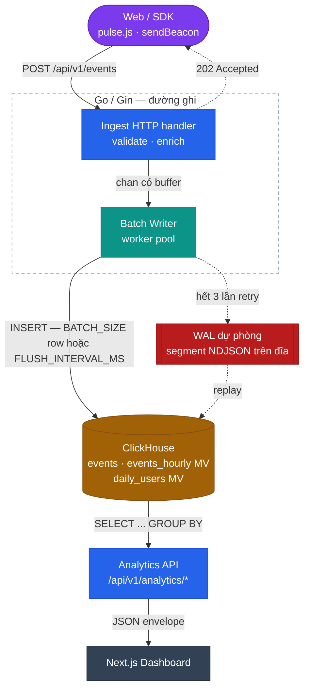
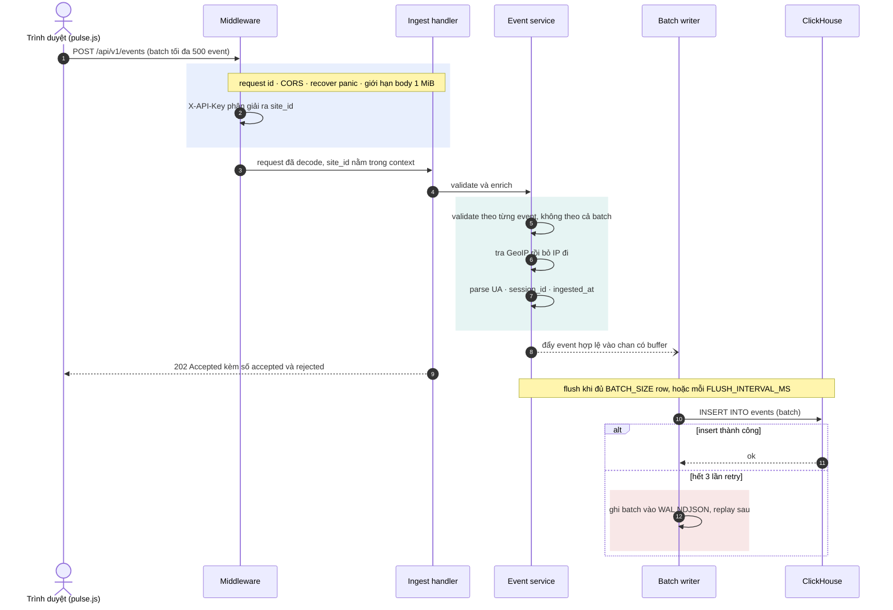
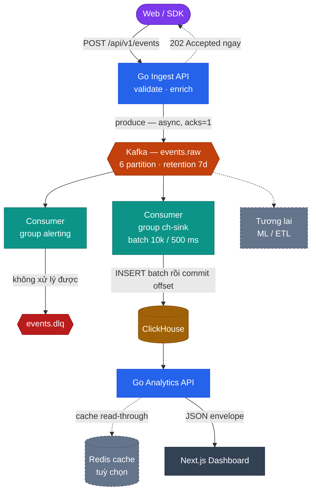
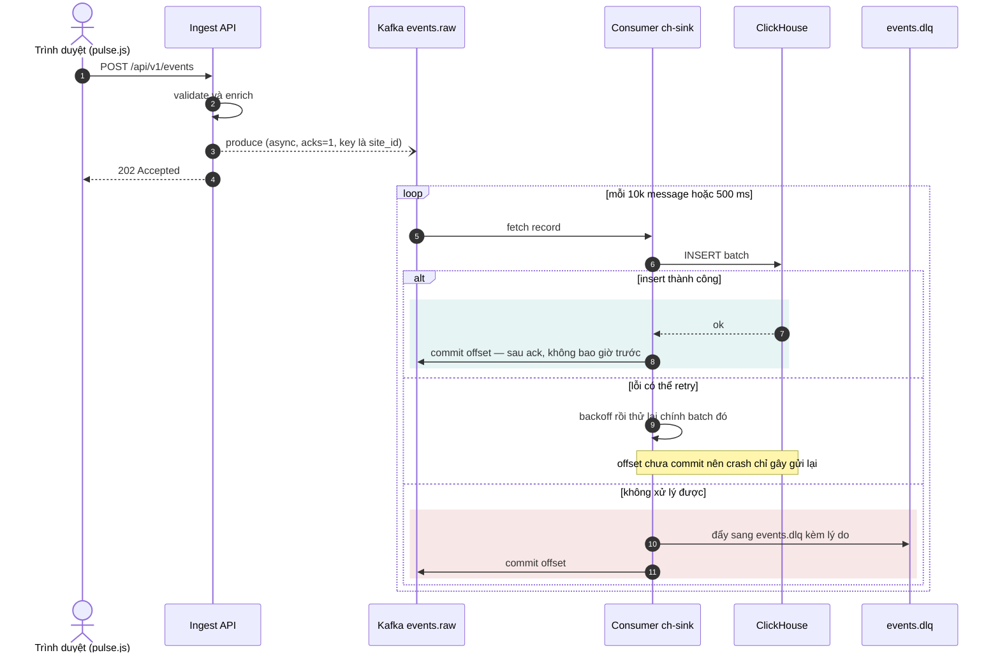
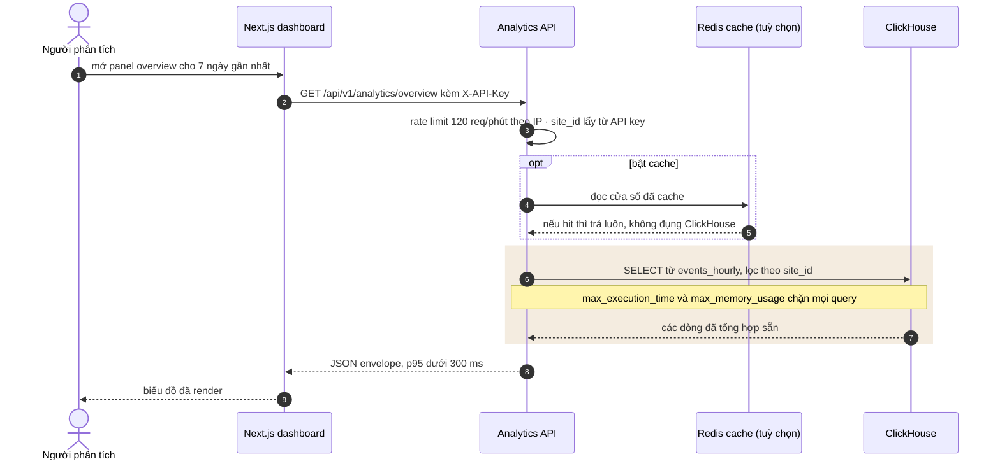

# Kiến trúc

Hệ thống xây theo hai phase. Phase 1 là monolith ghi thẳng vào ClickHouse, phủ Level 1 đến 3.
Phase 2 chèn Kafka vào giữa ingest và storage rồi tách binary; bắt đầu từ Level 4.

Cả hai phase tuân thủ cùng một luật: **đường ingest không bao giờ phụ thuộc vào việc ClickHouse
có sống hay không.**

::: tip Cách đọc sơ đồ
Mọi sơ đồ trong trang này là mã Mermaid, render ngay trên trình duyệt. Màu sắc mang ý nghĩa,
không phải trang trí: tím là client, xanh dương là service HTTP viết bằng Go, xanh ngọc là xử
lý bất đồng bộ, cam là message bus, hổ phách là storage, đỏ là đường lỗi.
:::

## Phase 1 — monolith

HTTP handler **không** ghi vào ClickHouse. Nó validate, enrich, đẩy vào channel có buffer rồi
trả `202`. Một worker pool rút channel đó và insert theo lô `BATCH_SIZE` row hoặc mỗi
`FLUSH_INTERVAL_MS`, cái nào tới trước.

Khi ClickHouse từ chối insert, writer retry ba lần với backoff luỹ thừa kèm jitter, rồi ghi
batch ra write-ahead log dạng NDJSON trên đĩa. Một tiến trình replay đọc lại các file đó sau.
Đó là thứ biến "kill ClickHouse năm phút mà không mất gì" thành một bài test thay vì một hy vọng.

### Một event, từ đầu đến cuối

Mũi tên `202` nét đứt ở sơ đồ trên chính là điểm mấu chốt: response rời đi trước khi row được
lưu xuống.

Mọi thứ trước `202` xảy ra bên trong request. Mọi thứ sau đó là việc của writer, và ClickHouse
chậm hay chết cũng không đổi được response trả về cho trình duyệt.

## Phase 2 — event pipeline

Kafka mang lại ba thứ mà ghi trực tiếp không có: ingest API thôi quan tâm ClickHouse có tới
được không, event replay được sau khi sửa schema, và một consumer group thứ hai đọc cùng luồng
mà không đụng vào đường ghi.

Cái giá là at-least-once. Consumer commit offset **sau khi** ClickHouse xác nhận insert, không
bao giờ trước, nên crash chỉ gây gửi lại chứ không mất. Trùng lặp được khử ở tầng query bằng
`event_id`. Xem ADR-0005 ở [trang quyết định](/vi/adr/).

### Offset được commit ở đâu

At-least-once là một đánh đổi có chủ đích: một row trùng thì khử ở tầng query rất rẻ, còn một
event đã mất thì không lấy lại được.

## Vòng đời một request

Chuyện gì xảy ra với một event, từ đầu đến cuối:

1. **Middleware.** Gắn request id UUIDv7 (hoặc tái dùng `X-Request-ID` từ ngoài vào), panic
   được chuyển thành `500` đúng envelope chuẩn, áp CORS, giới hạn body 1 MiB.
2. **Xác thực.** Header `X-API-Key` phân giải ra `site_id`, đặt vào context. Mọi query sau đó
   đều bị giới hạn theo nó — không có chuyện đọc chéo tenant.
3. **Validate.** Theo từng event, không theo cả batch. Batch 100 event có 3 event hỏng thì nhận
   97 và trả 3 cái kia trong mảng `rejected`. Một event hỏng không bao giờ làm mất cả lô.
4. **Enrich.** IP → country/city qua MaxMind GeoLite2, rồi **bỏ IP đi**. User-Agent → device,
   OS, browser. Thiếu `session_id` thì sinh từ hash cửa sổ 30 phút. Đóng dấu `ingested_at` để
   đo độ trễ.
5. **Sink.** Buffer, hoặc Kafka producer, tuỳ biến `SINK`.
6. **Phản hồi.** `202 Accepted`, kèm số event đã nhận và danh sách bị từ chối.

## Đường đọc

Đường ghi được tinh chỉnh để không mất event. Đường đọc được tinh chỉnh cho đúng một con số:
một panel dashboard trả lời dưới 300 ms ở mốc 100M row.

Materialized view là thứ khiến con số đó khả thi: `/analytics/overview` đọc `events_hourly`,
nhỏ hơn `events` vài bậc độ lớn, nên query chạm vào số giờ chứ không phải số row thô. Xem
[schema ClickHouse](/vi/reference/clickhouse).

## Vì sao ClickHouse

Workload là append-only, đọc chủ yếu ở dạng tổng hợp, và mọi query đều có hình dạng "gom
khoảng thời gian này theo một chiều cardinality thấp". Đó đúng là hình dạng mà column store
sinh ra để phục vụ: chỉ đọc những cột có trong query, tỉ lệ nén trên dữ liệu cột đã sắp xếp
tốt hơn hàng chục lần so với row store, và thực thi được vector hoá.

ClickHouse cũng dở ở những thứ dự án này không cần: point lookup theo primary key, UPDATE và
DELETE, JOIN lớn, transaction. Level 3 đo cả hai mặt đó so với PostgreSQL và ghi số lại — xem
[kết quả benchmark](/vi/notes/benchmark-results).

## Ngưỡng hiệu năng

Mỗi dòng dưới đây đều được kiểm chứng bằng test hoặc phép đo, không phải tuyên bố suông:

| Mục tiêu | Giá trị | Kiểm chứng ở |
|---|---|---|
| Dashboard query p95 ở 100M event | < 300 ms | Level 5 |
| `/analytics/overview` sau materialized view | < 100 ms | Level 5 |
| `/analytics/realtime` | < 200 ms | Level 5 |
| Throughput ingest | 10.000 event/s trong 10 phút, drop = 0 | Level 3 |
| p99 latency của ingest API | < 50 ms | Level 3 |
| End-to-end lag p99 ở 5k event/s | < 5 s | Level 4 |

## Sửa các sơ đồ này

Sơ đồ là các khối code `mermaid` ngay trong file này, do `vitepress-plugin-mermaid` render.
Hai quy tắc giữ cho chúng đồng bộ:

- **Không bao giờ ghim `theme` của Mermaid.** Plugin tự chuyển sang theme tối theo site. Màu
  của node đến từ bảng `classDef` khai báo ở cuối mỗi flowchart, và các màu nền đó đi kèm chữ
  trắng nên đọc được trên cả nền sáng lẫn nền tối.
- **Dùng lại bảng màu.** `client`, `api`, `proc`, `queue`, `store`, `ui`, `fallback` và
  `future` mang cùng một ý nghĩa trên mọi sơ đồ trong tài liệu. Hộp mới chọn một class có sẵn
  thay vì thêm màu mới.

## Đọc thêm

- [Schema ClickHouse](/vi/reference/clickhouse) — bảng, materialized view, vì sao có từng cái
- [Event schema](/vi/reference/event-schema) — contract payload và quy tắc validate
- [Quyết định kiến trúc](/vi/adr/) — mười quyết định và đánh đổi của chúng
