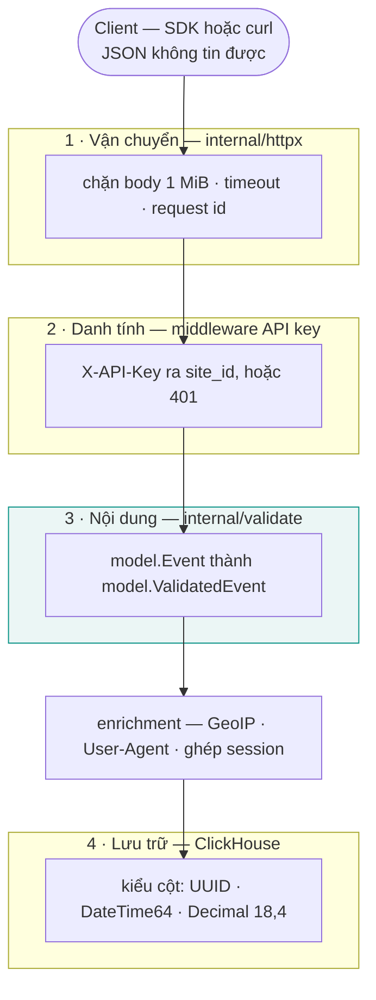
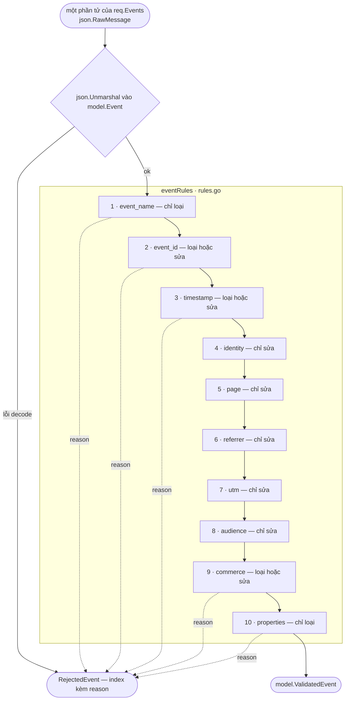
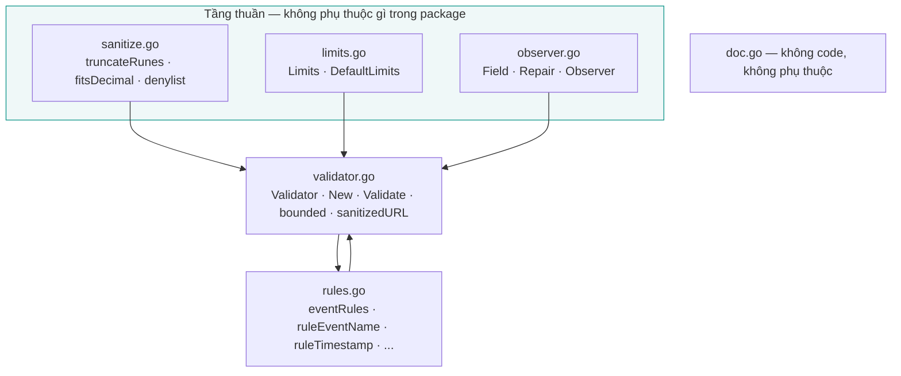
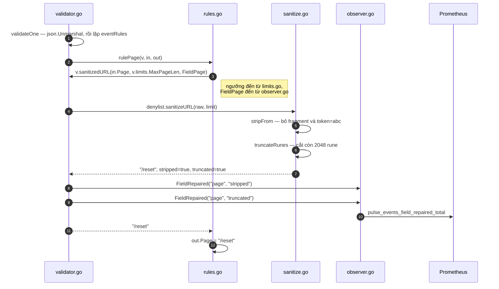

# Pipeline validate

`internal/validate` biến event mà client gửi lên thành event mà hệ thống được phép lưu.

Nó **không** phải một package validate đa dụng. Nó là biên vào của đường ghi, và hình dạng của
nó suy ra từ đúng một quyết định sản phẩm: batch 100 event có 3 event hỏng phải lưu 97 và báo
lại 3. Mọi thứ bên dưới đều là hệ quả của câu đó.

Bản thân các quy tắc nằm ở [tham chiếu event schema](/vi/reference/event-schema). Trang này nói
về **code**: pipeline được lắp ráp ra sao, và phải làm gì khi cần thêm vào nó.

## Validate nằm ở đâu

Có bốn thứ khác nhau cùng kiểm một request đi vào, và package này chỉ là một trong số đó.



| Tầng | Kiểm gì | Không biết gì |
|---|---|---|
| 1 · `httpx` | Kích thước và thời gian | Event là cái gì |
| 2 · middleware | Ai gọi, site nào | Trong body có gì |
| **3 · `validate`** | **Nội dung từng event** | Rằng nó bị gọi qua HTTP |
| 4 · ClickHouse | Kiểu cột | Event nào sai |

Nghe thì tầng 4 có vẻ đủ dùng một mình. Không đủ, vì **nó hỏng âm thầm**: `Decimal(18, 4)` nhận
một số không vừa thì bị cắt chứ không bị từ chối, và một con số doanh thu sai lặng lẽ còn tệ
hơn một event bị loại — vì không ai đi kiểm lại một con số trông rất hợp lý.

Nguyên tắc là: **để lỗi nổ ở chỗ còn nói được "event thứ 42, field revenue".** Đến lúc `INSERT`
trả về thì thông tin đó không còn nữa.

::: tip Validate ở biên, tin ở bên trong
Không tầng nào bên dưới tầng 3 kiểm lại. `repository` nhận `model.ValidatedEvent` và insert
thẳng — không có lần `if len(page) > 2048` thứ hai.

Đó không phải sự lười; đó là lý do tồn tại của hai kiểu dữ liệu. Chỉ `internal/validate` mới
tạo được `ValidatedEvent` có dữ liệu, nên compiler bảo đảm điều mà quy ước chỉ có thể đề nghị.
Kiểm lại ở tầng dưới nghĩa là bạn không tin kiểu dữ liệu của chính mình.
:::

## Hai loại lỗi

Đọc kỹ [PLAN.md §5.2](https://github.com/nxhawk/Real-time-Web-Analytics-Platform/blob/main/PLAN.md)
sẽ thấy nó tách làm hai. Đây là thứ quan trọng nhất cần hiểu trước khi động vào package.

| | **Loại (reject)** | **Sửa (repair)** |
|---|---|---|
| Nghĩa là gì | Client gửi sai thứ do chính nó sinh ra | Hoàn cảnh người dùng không chọn |
| Ví dụ | `event` không snake_case, `properties` là mảng, `revenue` tràn cột | Máy sai giờ, `user_id` dài hơn cột, URL dính `?token=` |
| Rule làm gì | `return model.ReasonXxx` | Sửa giá trị, gọi `observer.FieldRepaired(...)` |
| Cái giá | Một event, và client biết lý do | Không gì cả — event vẫn được lưu |

Chọn nhầm phía là lỗi nặng hơn viết code xấu:

- **Loại thứ đáng lẽ phải sửa** là vứt đi traffic thật. Người dùng có laptop lệch giờ hai ngày
  vẫn là người dùng thật.
- **Sửa thứ đáng lẽ phải loại** làm hỏng số liệu một cách âm thầm, và một bug trong SDK sẽ chạy
  hàng tháng vì không có gì phàn nàn cả.

Vì sao chuyện này không diễn đạt được bằng struct tag, và vì sao đã bỏ
`go-playground/validator/v10`: xem [ADR-0011](/vi/adr/0011-hand-written-event-validation).

## Pipeline

Một phần tử của `req.Events` đi qua đúng luồng này. Các rule chạy **theo thứ tự**, và một rule
được phép giả định mọi rule trước nó đã chạy xong.



Có hai chi tiết trong sơ đồ này mang trọng lượng.

**Phần tử được decode ở đây, không decode cùng envelope.** `IngestRequest.Events` là
`[]json.RawMessage`, nên `json.Unmarshal` chạy một lần cho mỗi phần tử. Decode cả batch thành
`[]model.Event` sẽ khiến một phần tử hỏng làm fail cả 100, và `encoding/json` không nói được nó
là phần tử nào. Partial success là tính chất của cách **parse** request, không phải của bất kỳ
validator nào.

**Rule loại đầu tiên kết thúc event đó.** Không có chuyện "gom hết lỗi của event này" — contract
là `{index, reason}`, một lý do. Gom nhiều hơn đồng nghĩa với một hình dạng API khác.

## Package được lắp ráp thế nào

Sáu file, sáu trách nhiệm.

| File | Vai trò | Ví von |
|---|---|---|
| `doc.go` | Tài liệu package, không có code | Bảng hướng dẫn treo ở cửa xưởng |
| `limits.go` | Mọi ngưỡng | Bảng thông số kỹ thuật |
| `sanitize.go` | Hàm thuần xử lý chuỗi và URL | Hộp dụng cụ |
| `observer.go` | Từ vựng để báo cáo | Bảng đèn báo |
| `rules.go` | Mỗi nhóm field một hàm | Quy trình sản xuất |
| `validator.go` | State và điều phối | Dây chuyền và quản đốc |



Ba file tầng thuần **không biết về nhau và không biết `Validator` tồn tại**. `validator.go` là
chỗ duy nhất biết cả ba. Riêng `sanitize.go` không import `model` lẫn bất cứ thứ gì liên quan
đến metric — nhận chuỗi, trả chuỗi.

`rules.go` và `validator.go` tham chiếu lẫn nhau; điều này hợp lệ trong cùng một package và là
cố ý: cỗ máy và quy trình chạy trên cỗ máy tách file nhưng là một đơn vị.

### Đi theo một giá trị

Lấy `page = "/reset?token=abc#top"`, dài 3000 ký tự.



Bước 5 đến 10 chính là lý do `sanitize.go` và `validator.go` là hai file riêng. `sanitize.go`
chỉ **trả về sự thật** — có strip gì không, có cắt gì không. Việc dịch sự thật đó thành lời gọi
metric là của `validator.go`.

Nếu `truncateRunes` tự đi báo metric thì nó phải nhận thêm hai tham số chỉ để làm việc đó, một
hàm cắt chuỗi bỗng phụ thuộc vào Prometheus, và `TestTruncateRunes` sẽ phải dựng cả một
`Validator` chỉ để kiểm `"abcdef"` thành `"abcde"`.

### Tóm một dòng cho mỗi file

- `doc.go` — **vì sao**
- `limits.go` — **bao nhiêu**
- `sanitize.go` — **làm bằng cách nào**, bằng hàm thuần
- `observer.go` — **báo cáo bằng từ nào**
- `rules.go` — **field nào theo quy tắc nào**
- `validator.go` — **ai giữ state và điều phối**

## Checklist: thêm một rule mới

Làm theo thứ tự. Bước 1 và 2 là quyết định; phần còn lại là cơ học.

### 1 · Quyết định loại hay sửa

Tự hỏi: *đây là bug của thứ do client sinh ra, hay là hoàn cảnh người dùng không chọn?* Xem
[Hai loại lỗi](#hai-loai-loi). Đừng bỏ qua bước này — nó quyết định một nửa số bước bên dưới.

### 2 · Quyết định nó có thuộc package này không

`internal/validate` là **đường ghi của ingest**. Một model không phải event thường thuộc chỗ
khác — xem [Validate cho thứ không phải event](#validate-cho-thu-khong-phai-event).

### 3 · Danh sách việc

- [ ] **`model/event.go`** — thêm field vào `Event` (lỏng: `string`, `json.Number`,
      `json.RawMessage`) và vào `ValidatedEvent` (chặt: đúng kiểu mà cột cần)
- [ ] **Một migration**, nếu field cần cột ClickHouse mới. `ValidatedEvent` phải khớp DDL 1:1,
      nếu không repository sẽ `Append` lệch cột
- [ ] **`validate/limits.go`** — thêm ngưỡng vào `Limits`, vào `DefaultLimits()`, **và một dòng
      vào `withDefaults()`**. Quên cái thứ ba là lỗi hay gặp nhất: ngưỡng lặng lẽ ở lại 0
- [ ] **`PHASES.md` §2.3** — nếu con số đó còn xuất hiện ở chỗ khác, sửa ở đó *trước*, rồi mới
      lan sang các nơi còn lại (CLAUDE.md §5)
- [ ] **`validate/observer.go`** — thêm hằng `Field`, nếu rule có sửa gì
- [ ] **`model/reason.go`** — thêm `RejectReason` **và** một dòng trong slice `rejectReasons`,
      nếu rule có loại. Thiếu dòng trong slice thì `Valid()` trả false và
      `TestRejectReasonValid` fail
- [ ] **`validate/rules.go`** — viết `ruleXxx`, rồi thêm **một dòng** vào `eventRules` đúng vị
      trí nó cần chạy
- [ ] **`validate/rules_test.go`** — thêm accessor và ít nhất một case với
      `rule: "<tên mới>"`. Không phải tuỳ chọn: thiếu là `TestEveryRuleHasACase` fail
- [ ] **`docs/reference/event-schema.md`** và bản `docs/vi/` — thêm dòng vào bảng loại hoặc
      bảng sửa
- [ ] **`make check`** — không còn finding nào, và
      `go test ./internal/model/... ./internal/validate/...` vẫn trên 85% coverage

### 4 · Ví dụ đầy đủ

Giả sử payload có thêm `"language": "vi"` và bảng có thêm cột
`language LowCardinality(String)`.

**`model/event.go`**

```go
type Event struct {
    // ...
    Language string `json:"language,omitempty"`
}

type ValidatedEvent struct {
    // ... trong nhóm audience, theo đúng thứ tự cột của DDL
    Language string // ISO 639-1, lower case; empty until enrichment fills it
}
```

**`validate/observer.go`**

```go
const (
    // ...
    FieldLanguage Field = "language"
)
```

**`validate/rules.go`**

```go
// ruleLanguage normalises the visitor's language tag.
//
// Repaired rather than rejected: the tag is a browser hint, not something the visitor typed,
// and clearing an unknown one is what gives Accept-Language enrichment its chance at it.
func ruleLanguage(v *Validator, in *model.Event, out *model.ValidatedEvent) model.RejectReason {
    lang := strings.ToLower(strings.TrimSpace(in.Language))
    if lang != "" && !isLowerAlpha(lang, 2) {
        lang = ""
        v.observer.FieldRepaired(string(FieldLanguage), string(RepairStripped))
    }

    out.Language = lang
    return model.ReasonNone
}
```

và một dòng vào registry:

```go
var eventRules = []eventRule{
    // ...
    {"audience", ruleAudience},
    {"language", ruleLanguage}, // [!code ++]
    {"commerce", ruleCommerce},
}
```

**`validate/rules_test.go`**

```go
language := func(e model.ValidatedEvent) any { return e.Language }

// --- language ---------------------------------------------------------
{
    name:  "a language tag is lower-cased",
    rule:  "language",
    event: model.Event{Event: "page_view", Language: "VI"},
    field: language, want: "vi",
},
{
    name:  "a tag that is not ISO 639-1 is cleared for enrichment",
    rule:  "language",
    event: model.Event{Event: "page_view", Language: "vietnamese"},
    field: language, want: "",
    repairs: []string{"event_id:defaulted", "language:stripped", "timestamp:defaulted"},
},
```

::: warning `repairs` so sánh theo thứ tự alphabet, và bao gồm cả phần mặc định
Event không set `event_id` và `timestamp` thì luôn sinh ra `event_id:defaulted` và
`timestamp:defaulted`, nên case nào kiểm `repairs` cũng phải liệt kê chúng, theo thứ tự
alphabet. Đặt `repairs: nil` để bỏ qua kiểm tra này khi case không nói về phép sửa.
:::

Nếu rule là loại **reject**, thêm reason ở cả hai chỗ:

```go
// model/reason.go
const (
    // ...
    ReasonInvalidLanguage RejectReason = "invalid_language"
)

var rejectReasons = []RejectReason{
    // ...
    ReasonInvalidLanguage, // [!code ++]
}
```

và test case chỉ cần `reason`:

```go
{
    name:   "an unknown language tag is rejected",
    rule:   "language",
    event:  model.Event{Event: "page_view", Language: "vietnamese"},
    reason: model.ReasonInvalidLanguage,
},
```

### 5 · Những thay đổi nhẹ hơn

**Đổi một ngưỡng** — sửa `DefaultLimits()`, nhưng phải sửa
[`PHASES.md` §2.3](https://github.com/nxhawk/Real-time-Web-Analytics-Platform/blob/main/PHASES.md)
trước, rồi mới lan sang `PLAN.md` §5.2 và cả hai trang event-schema.

**Thêm param vào denylist** — không sửa code. Tên phổ quát (`session_token`) thì thêm vào
`builtinSensitiveParams` trong `sanitize.go`; thứ chỉ riêng một deployment thì đặt
`SENSITIVE_QUERY_PARAMS`, không cần deploy lại. Xem [Cấu hình](/vi/guide/configuration).

**Thêm một hàm thuần** — viết vào `sanitize.go`, không nhận `*Validator`, không đụng `Observer`,
rồi test trực tiếp trong `sanitize_test.go`. Rẻ hơn nhiều so với dựng cả một event để chạm tới
nó.

### Ba thứ đừng làm

- **Đừng gọi `metrics.` trong rule.** Đi qua `v.observer`. Rule mà import Prometheus là rule mà
  test không dùng `t.Parallel()` được nữa.
- **Đừng hardcode con số trong rule.** `if len(x) > 128` phải là `v.limits.MaxUserIDLen`. Ngưỡng
  là dữ liệu.
- **Đừng gọi thẳng `time.Now()`.** Dùng `v.now()`, nếu không test clock skew sẽ thành cuộc đua
  với đồng hồ thật thay vì một input cố định.

## Validate cho thứ không phải event

Phần lớn model mới **không** thuộc `internal/validate`. Thứ quyết định là *hình dạng của lỗi*,
không phải việc chữ "validate" có áp dụng được hay không.

| Model thuộc về | Ví dụ | Validate nằm ở | Hình dạng lỗi |
|---|---|---|---|
| Đường ghi | `Session` (L3), DLQ entry (L4) | `internal/validate` | Partial success — `{index, reason}` |
| Tham số truy vấn | `TimeRange`, `PagesQuery` (L1.5) | parse ở `handler/`, rule ở `service/` | All-or-nothing — `400 invalid_range` |
| Cấu hình / quản trị | `Site`, `ApiKey` | `service/` | Theo field — `details: {field: code}` |

`Result{Accepted, Rejected}` chỉ có nghĩa khi bạn xử lý một **lô** và một phần tử hỏng không
được làm hỏng phần còn lại. Đó là chuyện riêng của event ingest. Một `TimeRange` không có
partial success: `from > to` là cả request sai.

Hai lưu ý cho ngày đó:

- **Đổi tên trước.** `validate.Validator` và `validate.New` hiện đang chiếm tên chung cho đường
  event. Ngay khi có model thứ hai trên đường ghi, chúng nên thành `validate.EventValidator` và
  `validate.NewEventValidator`. Rẻ lúc này, đắt về sau.
- **Dùng lại `sanitize.go`, không dùng lại `Validator`.** Các hàm thuần chạy cho model nào cũng
  được — đó là phần thưởng của việc giữ chúng không receiver, không observer. `Limits` và
  `RejectReason` là của riêng event; riêng `RejectReason` vừa là contract API vừa là label
  Prometheus.

## Xem thêm

- [Event schema](/vi/reference/event-schema) — bản thân các quy tắc, theo từng field
- [ADR-0011](/vi/adr/0011-hand-written-event-validation) — vì sao quy tắc được viết tay
- [Cấu hình](/vi/guide/configuration) — `ingest.sensitive_query_params`
- [Cấu trúc dự án](/vi/guide/project-structure) — mỗi package nằm ở đâu
