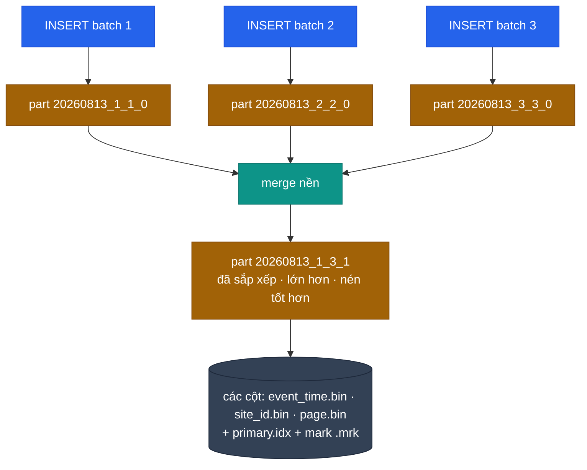

# ClickHouse giải thích chi tiết

<Badge type="tip" text="Kiến thức" />

Trang này là phần giải thích dài mà [Schema ClickHouse](/vi/reference/clickhouse) cố tình bỏ
qua. Trang kia nói schema của dự án **là gì**; trang này nói **ClickHouse là gì**, vì sao nó
hoạt động như vậy, và làm sao để chọn giữa nó, PostgreSQL và Elasticsearch.

Đọc một lượt từ đầu đến cuối, sau đó quay lại từng mục khi cần. Không có gì ở đây gắn với Pulse
Analytics cho tới [mục cuối](#pulse-analytics-dung-nhung-thu-nay-nhu-the-nao).

::: tip Bản tóm tắt một đoạn
ClickHouse là một cơ sở dữ liệu OLAP hướng cột. Nó lưu mỗi cột trong file riêng, sắp xếp theo
một khoá do bạn chọn, nén rất mạnh, và chỉ đọc đúng những cột cùng những khoảng row mà query
thực sự cần. Nhờ vậy việc tổng hợp trên hàng tỉ row trở nên nhanh và rẻ. Đổi lại, nó từ bỏ gần
như mọi thứ mà một CSDL giao dịch làm hộ bạn: không transaction thật sự, không foreign key,
không unique constraint, không update một row rẻ tiền, và khử trùng lặp là **eventual** chứ
không tức thì. Đây là CSDL cho câu hỏi về **nhiều row**, không phải để lưu **một row** cho
chính xác.
:::

## Phần 1 — ClickHouse thực chất là gì

### OLTP và OLAP

Hai loại workload, hai hình dạng cơ sở dữ liệu.

| | OLTP (PostgreSQL, MySQL) | OLAP (ClickHouse, BigQuery, Druid) |
|---|---|---|
| Query điển hình | `SELECT * FROM users WHERE id = 42` | `SELECT country, count() FROM events WHERE day > … GROUP BY country` |
| Số row chạm tới | 1 đến vài trăm | hàng triệu đến hàng tỉ |
| Số cột chạm tới | gần như cả row | 2–5 trong số 50 |
| Ghi | nhiều lệnh nhỏ, có transaction | ít lệnh, batch lớn, chỉ append |
| Tối ưu cho | tính đúng đắn của một bản ghi | thông lượng trên một tập bản ghi |
| Ngân sách độ trễ | 1 ms | 100 ms — 10 s |

Dashboard hỏi "số session mỗi ngày theo quốc gia trong 90 ngày qua" là hình dạng OLAP. Luồng
thanh toán trừ tiền ví là hình dạng OLTP. Mọi khác biệt thiết kế bên dưới đều bắt nguồn từ đây.

### Lưu trữ hướng cột

Row store để các trường của một bản ghi cạnh nhau trên đĩa. Column store để các giá trị của
cùng một cột cạnh nhau.

```text
Row store (heap page của PostgreSQL)
  [1|/home|VN|Chrome|2026-08-13] [2|/pricing|US|Safari|2026-08-13] [3|/home|VN|Firefox|…]
  → đọc `country` vẫn kéo theo mọi trường khác vào bộ nhớ

Column store (part của ClickHouse)
  id      : [1, 2, 3, …]              → id.bin
  page    : [/home, /pricing, /home]  → page.bin
  country : [VN, US, VN, …]           → country.bin
  browser : [Chrome, Safari, Firefox] → browser.bin
  → `SELECT country, count() … GROUP BY country` chỉ mở đúng một file
```

Ba hệ quả, và đó là toàn bộ câu chuyện:

1. **Bạn chỉ trả tiền cho những cột bạn gọi tên.** Vì vậy `SELECT *` trên bảng rộng trong
   ClickHouse không phải lỗi nhỏ — nó thường chậm gấp 10 lần. Luôn liệt kê cột.
2. **Tỉ lệ nén tốt hơn hẳn.** Các giá trị liền kề trong một cột rất giống nhau — vẫn hơn 200 mã
   quốc gia đó, timestamp cách nhau vài giây, vài cái tên browser. Nén 10–30 lần là bình thường,
   so với khoảng 2–4 lần ở row store. Ít dữ liệu trên đĩa nghĩa là ít I/O, và đó mới là lý do
   thật sự khiến query nhanh.
3. **Thao tác trên một row trở nên đắt.** Sửa một trường của một row nghĩa là ghi lại cả một
   khối trong file cột. Đó là lý do ClickHouse coi UPDATE là thao tác hiếm, bất đồng bộ và nặng,
   còn PostgreSQL coi đó là chuyện thường ngày.

### Thực thi vector hoá (vectorized execution)

ClickHouse không xử lý từng row. Nó lấy một block ~65k giá trị của một cột rồi chạy phép toán
trên cả block, giữ cho SIMD và cache của CPU luôn bận thay vì trả chi phí thông dịch cho từng
row. Kết hợp với đa luồng trong một query — một query dùng hết mọi core của máy — đó là nửa còn
lại của câu chuyện tốc độ.

Bạn không cấu hình gì cả, nhưng nó giải thích một điều hay gây bất ngờ: query trên 100M row có
thể **nhanh hơn** một query trên 1M row ở CSDL row store, và thêm một cột vào `GROUP BY` thường
gần như miễn phí trong khi thêm một `JOIN` thì rất đắt.

### Vị trí của ClickHouse

- **Một node đi xa hơn nhiều người tưởng.** Một máy nhiều core với NVMe phục vụ thoải mái hàng
  chục tỉ row. Chỉ lên cluster vì thông lượng ingest, yêu cầu HA hoặc kích thước dữ liệu — đừng
  lên theo phản xạ.
- **Cluster là tường minh, không tự động.** Sharding và replication là thứ bạn cấu hình
  (`ReplicatedMergeTree`, bảng `Distributed`, ClickHouse Keeper), không phải thứ có sẵn. Xem
  [Replication và sharding](#replication-va-sharding-trong-mot-trang).

## Phần 2 — Các khái niệm, lần lượt từng cái

### Table engine

Engine quyết định bảng lưu dữ liệu thế nào và chuyện gì xảy ra khi merge. Còn lại là chi tiết.

| Họ | Engine | Dùng cho |
|---|---|---|
| **MergeTree** | `MergeTree`, `ReplacingMergeTree`, `SummingMergeTree`, `AggregatingMergeTree`, `CollapsingMergeTree`, `VersionedCollapsingMergeTree`, và bản `Replicated` tương ứng | 99% bảng thật |
| **Log** | `TinyLog`, `StripeLog`, `Log` | bảng nháp rất nhỏ, không index, không đồng thời |
| **Integration** | `Kafka`, `S3`, `MySQL`, `PostgreSQL`, `MongoDB`, `URL` | đọc hệ thống ngoài như thể là bảng |
| **Đặc biệt** | `Distributed`, `Memory`, `Null`, `Merge`, `Dictionary`, `View`, `MaterializedView`, `Buffer` | định tuyến, test, keo dán |

`Null` đáng nhắc riêng: nó vứt bỏ mọi thứ ghi vào, nhưng materialized view gắn lên nó vẫn chạy.
Đó là mẹo chuẩn cho tình huống "biến đổi lúc insert mà không giữ row thô".

### MergeTree: part, granule, mark, merge

Đây là mô hình tư duy mà mọi thứ khác treo lên.

- Một lệnh **INSERT** không ghi nối vào file có sẵn. Nó tạo ra một **part** hoàn toàn mới: một
  thư mục chứa một file `.bin` cho mỗi cột, đã sắp xếp theo `ORDER BY` của bảng.
- Một luồng nền **merge** các part nhỏ thành part lớn hơn, vẫn giữ thứ tự. Đây chính là cây
  log-structured merge, nên mới có cái tên MergeTree.
- Trong một part, các row được gom thành **granule**, mỗi granule `index_granularity` row (mặc
  định 8192). Granule là đơn vị nhỏ nhất mà ClickHouse chịu đọc — hỏi 1 row thì đọc 8192 row.
- **Primary index** lưu một entry cho mỗi granule (giá trị khoá sắp xếp tại row đầu tiên) trong
  file `primary.idx` nằm thường trú trong RAM. **Mark** (`.mrk`) ánh xạ số hiệu granule sang
  offset byte trong từng file cột.



Hai hệ quả thực tế:

- **Insert theo batch lớn.** Mỗi insert tốn một part; quá nhiều part thì merge không đuổi kịp,
  sinh ra lỗi kinh điển `Too many parts` (error 252). Nhắm tối thiểu 10k row mỗi insert và tối
  đa ~1 insert/giây/bảng. Nếu producer không batch được, bật
  [async insert](#async-insert).
- **Mọi thứ trong một bảng là eventually consistent.** Khử trùng lặp, cộng dồn và tổng hợp chỉ
  xảy ra khi part merge, và bạn không biết trước lúc nào.

### ORDER BY — quyết định quan trọng nhất

Trong MergeTree, `ORDER BY` là **sorting key**: thứ tự vật lý của row trên đĩa. Nếu bạn không
khai báo `PRIMARY KEY` riêng, nó cũng chính là primary index.

```sql
CREATE TABLE events (
    site_id     UInt32,
    event_name  LowCardinality(String),
    event_time  DateTime,
    user_id     String,
    page        String
) ENGINE = MergeTree
PARTITION BY toYYYYMM(event_time)
ORDER BY (site_id, event_name, event_time)
SETTINGS index_granularity = 8192;
```

::: warning Đây không phải primary key kiểu PostgreSQL
Nó không ép tính duy nhất. Nó không ngăn trùng lặp. Hai row giống hệt nhau vẫn insert được bình
thường. Nó thuần tuý là "dữ liệu được xếp thế nào", và đổi nó về sau nghĩa là dựng lại bảng.
:::

**Vì sao nó làm query nhanh — bỏ qua granule.** Primary index giữ giá trị khoá sắp xếp ở đầu mỗi
granule. Với `WHERE site_id = 7 AND event_time >= '2026-08-01'`, ClickHouse tìm nhị phân trên
index nằm sẵn trong RAM, xác định các dải granule **có thể** khớp, và chỉ đọc đúng những dải đó.
Một bảng 100M row mà bộ lọc khớp 200k row có thể chỉ đọc ~208k row — phần dư là mấy granule ở
rìa. `EXPLAIN indexes = 1` cho biết chính xác đã loại bỏ bao nhiêu granule.

**Luật tiền tố (prefix).** Index chỉ dùng được từ trái sang phải. Với
`ORDER BY (site_id, event_name, event_time)`:

| Bộ lọc trong query | Dùng được index? |
|---|---|
| `site_id = 7` | có — cột đầu tiên |
| `site_id = 7 AND event_name = 'pageview'` | có — tiền tố hai cột |
| `site_id = 7 AND event_time > …` | một phần — thu hẹp theo `site_id` rồi quét bên trong |
| chỉ `event_name = 'pageview'` | không — full scan |
| `user_id = 'u_1'` | không — không nằm trong khoá |

**Chọn nó thế nào.**

1. Xuất phát từ những query bạn thực sự chạy. Cột xuất hiện trong **mọi** `WHERE` đứng đầu.
2. Giữa các ứng viên, **cardinality thấp đứng trước** — tạo ra chuỗi giá trị giống nhau dài hơn,
   nên index thô hơn nhưng nén tốt hơn nhiều.
3. Đặt cột thời gian ở cuối hoặc gần cuối. Quét theo dải hoạt động tự nhiên ở cột khoá cuối.
4. Đừng thêm cột "cho chắc". Mỗi cột khoá thừa làm merge và insert chậm đi.
5. Với query mà không thứ tự nào phục vụ được (ở đây là `user_id`), dùng
   [projection](#projection) hoặc [data-skipping index](#data-skipping-index) thay vì bẻ cong
   khoá.

**Nó còn quyết định tỉ lệ nén.** Sắp xếp theo `country` khiến mọi giá trị `VN` nằm liền nhau,
codec thấy một chuỗi dài lặp lại và mã hoá gần như bằng không. Cùng cột đó dưới thứ tự khác có
thể lớn gấp nhiều lần. Thứ tự sắp xếp là quyết định về **lưu trữ** không kém gì về index.

**`PRIMARY KEY` như một tiền tố ngắn hơn.** Bạn có thể làm index thô hơn thứ tự sắp xếp:

```sql
ORDER BY (site_id, event_name, event_time, user_id)
PRIMARY KEY (site_id, event_name)
```

Row vẫn được sắp theo cả bốn cột — có ích cho nén và cho khoá khử trùng lặp của
`ReplacingMergeTree` — nhưng `primary.idx` chỉ lưu hai cột nên tốn ít RAM hơn nhiều.
`PRIMARY KEY` bắt buộc phải là tiền tố của `ORDER BY`.

### index_granularity

Số row trên mỗi granule; mặc định 8192.

- **Nhỏ hơn (4096)** — index mịn hơn, tốt cho point lookup, file mark lớn hơn, tốn RAM hơn.
- **Lớn hơn (16384)** — index thô hơn, mark nhỏ hơn, hợp với full scan thuần tuý.

Còn có `index_granularity_bytes` (granule thích ứng, mặc định bật) để thu nhỏ granule khi row
lớn, đảm bảo một granule không vượt quá ~10 MB. Chỉ đổi những thứ này khi có số đo trong tay;
mặc định gần như luôn đúng.

### PARTITION BY

Partition chia bảng thành các nhóm thư mục độc lập. **Nó không phải index và không phải cách làm
query nhanh** — đó là việc của `ORDER BY`. Partition tồn tại để bạn có thể:

- `DROP PARTITION` — xoá một tháng dữ liệu tức thì, không cần mutation.
- Áp TTL và phân tầng lưu trữ theo từng partition.
- Cho phép cắt bỏ nguyên partition với bộ lọc thô.
- Giữ merge cục bộ — part ở hai partition khác nhau không bao giờ merge với nhau.

```sql
PARTITION BY toYYYYMM(event_time)   -- tốt: vài chục partition
PARTITION BY toDate(event_time)     -- rủi ro: 365 partition/năm, nhiều part nhỏ
PARTITION BY (site_id, toDate(t))   -- thường là sai lầm: bùng nổ partition
```

Quy tắc ngón tay cái: nhắm **vài chục đến vài trăm** partition mỗi bảng, đừng bao giờ hàng
nghìn. Quá nhiều partition nghĩa là quá nhiều part, merge chậm, và lại `Too many parts`.

### Data-skipping index

Index thứ cấp trong ClickHouse **không trỏ tới row**. Nó lưu một bản tóm tắt nhỏ cho mỗi *N
granule* và cho phép bỏ qua các block chắc chắn không khớp. Nó chỉ có thể tiết kiệm I/O; nó
không bao giờ biến một lookup thành O(log n).

```sql
ALTER TABLE events
  ADD INDEX idx_user user_id TYPE bloom_filter(0.01) GRANULARITY 4,
  ADD INDEX idx_ingested ingested_at TYPE minmax GRANULARITY 1,
  ADD INDEX idx_page_tok page TYPE tokenbf_v1(4096, 3, 0) GRANULARITY 2;

-- index chỉ phủ dữ liệu được ghi sau khi nó tồn tại
ALTER TABLE events MATERIALIZE INDEX idx_user;
```

| Loại | Lưu gì | Hợp với |
|---|---|---|
| `minmax` | min và max mỗi block | cột tương quan với thứ tự sắp xếp — `ingested_at`, id tăng dần |
| `set(N)` | tối đa N giá trị phân biệt mỗi block | cột cardinality thấp không nằm trong khoá |
| `bloom_filter(p)` | Bloom filter của giá trị | so sánh bằng trên cột cardinality cao — `user_id = 'u_1'` |
| `tokenbf_v1(size, hashes, seed)` | Bloom filter của token từ | `hasToken(page, 'checkout')`, tìm trong log |
| `ngrambf_v1(n, size, hashes, seed)` | Bloom filter của n-gram | `LIKE '%chuỗi con%'` |

`GRANULARITY k` nghĩa là "một entry index cho mỗi k granule". k lớn = index nhỏ, bỏ qua thô hơn.
Một skip index trên cột không tương quan với thứ tự sắp xếp thường chẳng bỏ qua được gì mà vẫn
tốn đĩa và làm chậm insert — luôn kiểm chứng bằng `read_rows` trước và sau.

### Projection

Projection là một bản sao vật lý thứ hai của bảng, nằm ngay trong cùng các part, với thứ tự sắp
xếp khác hoặc đã tổng hợp sẵn. Optimizer tự chọn nó khi có lợi. Đây là câu trả lời sạch sẽ cho
"khoá của tôi phục vụ dashboard nhưng tôi còn cần tra theo user".

```sql
ALTER TABLE events ADD PROJECTION proj_by_user (
    SELECT * ORDER BY (user_id, event_time)
);
ALTER TABLE events MATERIALIZE PROJECTION proj_by_user;
```

Projection dạng tổng hợp cũng được:

```sql
ALTER TABLE events ADD PROJECTION proj_country_day (
    SELECT site_id, toDate(event_time) AS d, country, count()
    GROUP BY site_id, d, country
);
```

Chi phí là có thật và phải đo: **đĩa phình ra**, **insert chậm lại**, và mỗi lần merge phải làm
việc hai lần. Ba con số quyết định giữ hay bỏ — mức tăng dung lượng, mức giảm thông lượng insert,
mức tăng tốc query.

### Materialized View — một trigger insert, không phải cache

Đây là khái niệm khiến mọi người từ PostgreSQL sang đều vấp. Materialized view của ClickHouse
**không** lưu kết quả một query rồi refresh định kỳ. Nó là trigger: khi một block row được insert
vào bảng nguồn, câu `SELECT` của view chạy **trên đúng block đó** và ghi kết quả vào bảng đích.

```sql
CREATE TABLE events_hourly (
    site_id    UInt32,
    hour       DateTime,
    country    LowCardinality(String),
    events     AggregateFunction(count),
    uniq_users AggregateFunction(uniq, String)
) ENGINE = AggregatingMergeTree
ORDER BY (site_id, country, hour);

CREATE MATERIALIZED VIEW events_hourly_mv TO events_hourly AS
SELECT
    site_id,
    toStartOfHour(event_time) AS hour,
    country,
    countState()        AS events,
    uniqState(user_id)  AS uniq_users
FROM events
GROUP BY site_id, hour, country;
```

Đọc lại:

```sql
SELECT hour, countMerge(events) AS events, uniqMerge(uniq_users) AS users
FROM events_hourly
WHERE site_id = 7 AND hour >= now() - INTERVAL 7 DAY
GROUP BY hour ORDER BY hour;
```

Bốn điều kéo theo, và cái nào cũng từng cắn ai đó:

- **Lưu state, không lưu giá trị.** `countState()` / `uniqState()` ghi trạng thái tổng hợp một
  phần, merge đúng khi part merge; `countMerge()` / `uniqMerge()` hoàn tất lúc đọc. Ghi
  `count()` thường vào `AggregatingMergeTree` thì số đúng cho tới lần merge đầu tiên, rồi sai
  một cách âm thầm. (Với các hàm giao hoán đơn giản như `sum`, `min`, `max`,
  `SimpleAggregateFunction` là lựa chọn rẻ hơn và không cần `-Merge`.)
- **View chỉ thấy những insert xảy ra sau khi nó được tạo.** Dữ liệu lịch sử cần
  `INSERT INTO … SELECT` backfill tường minh, chạy từng tháng để không cạn RAM, và cẩn thận biên
  để không đếm hai lần.
- **Cardinality trong `GROUP BY` là toàn bộ vấn đề.** Chỉ cột cardinality thấp mới được vào đó.
  Nhét `page` hay `user_id` vào thì "bảng tổng hợp" gần bằng bảng thô. Luật dùng ở đây: nếu tổng
  các view vượt 15% bảng thô thì `GROUP BY` đang sai.
- **View lỗi có thể làm hỏng lệnh insert.** Mặc định lỗi được đẩy ngược về phía ghi.

ClickHouse cũng có **refreshable materialized view** (`REFRESH EVERY 1 HOUR`), tức kiểu tính lại
định kỳ giống PostgreSQL — hữu ích khi query không thể diễn đạt theo kiểu tăng dần.

### Các engine MergeTree chuyên biệt

Tất cả đều làm việc **trong lúc merge**, nghĩa là hiệu quả thấy được là eventual, không tức thì.

| Engine | Hành vi khi merge | Dùng cho |
|---|---|---|
| `ReplacingMergeTree(ver)` | giữ một row cho mỗi sorting key — bản có `ver` lớn nhất | bảng chiều, upsert, trạng thái mới nhất |
| `SummingMergeTree(cols)` | cộng các cột số khi sorting key trùng nhau | bộ đếm đơn giản |
| `AggregatingMergeTree` | merge các state `AggregateFunction` | bảng đích của materialized view |
| `CollapsingMergeTree(sign)` | triệt tiêu row `+1` với row `-1` | row có thể đổi mà không cần UPDATE |
| `VersionedCollapsingMergeTree(sign, ver)` | như trên, chịu được dữ liệu đến sai thứ tự | như trên, qua message queue |

```sql
CREATE TABLE user_first_seen (
    site_id    UInt32,
    user_id    String,
    first_seen DateTime
) ENGINE = ReplacingMergeTree(first_seen)
ORDER BY (site_id, user_id);
```

`SELECT … FINAL` ép gộp ngay lúc đọc để bạn thấy dữ liệu đã khử trùng lặp. Nó cũng **rất** đắt,
vì phải merge tại chỗ mọi part khớp. Đừng bao giờ đặt `FINAL` trên đường đi nóng của dashboard;
hãy thiết kế sao cho không cần, hoặc dùng `argMax(value, version)` ngay trong query.

### Những kiểu dữ liệu quan trọng

| Kiểu | Vì sao quan trọng |
|---|---|
| `LowCardinality(String)` | mã hoá từ điển cho cột ít giá trị phân biệt. Thắng lớn về dung lượng và `GROUP BY` khi dưới ~10k giá trị; **lỗ** khi trên ~100k |
| `Nullable(T)` | lưu thêm bitmap null, chặn vài tối ưu hoá, và khó đưa vào khoá. Nên dùng `T` với giá trị mặc định |
| `Enum8` / `Enum16` | tập giá trị cố định, kiểm tra lúc ghi; lưu dưới dạng số nguyên |
| `DateTime` và `DateTime64(3)` | giây và mili giây. Đừng bao giờ lưu giờ địa phương — lưu UTC rồi đổi bằng `toTimeZone()` lúc đọc |
| `UInt8` làm boolean | không có kiểu `Boolean` nào đáng dùng |
| `Array(T)`, `Map(K,V)`, `Tuple`, `Nested` | dữ liệu lồng nhau hạng nhất, truy vấn bằng `arrayJoin`, `has()`, hàm bậc cao |
| `JSON` | kiểu cột động thế hệ mới; bên dưới nó vật chất hoá các nhánh thành cột thật |
| `UUID`, `IPv4`, `IPv6` | độ rộng cố định, nhỏ hơn nhiều so với dạng chuỗi |
| `Decimal(P,S)` | khi sai số float là không chấp nhận được — tiền |

### Codec và nén

Nén được chọn theo từng cột, và điểm ăn tiền là ghép một codec **biến đổi** với một codec tổng
quát:

```sql
event_time   DateTime  CODEC(Delta, ZSTD(1)),      -- tăng đơn điệu → delta rất nhỏ
sequence_id  UInt64    CODEC(DoubleDelta, ZSTD(1)),-- bước tăng gần như không đổi
duration_ms  UInt32    CODEC(T64, ZSTD(1)),        -- số nguyên nhỏ, đóng gói bit
page         String    CODEC(ZSTD(1)),             -- văn bản
sampled_rate Float64   CODEC(Gorilla, ZSTD(1))     -- float đổi chậm
```

`LZ4` (mặc định) giải nén nhanh nhất; `ZSTD(1)` là mặc định tốt cho dữ liệu nóng; `ZSTD(9+)` cho
dữ liệu lạnh hiếm đọc. Hãy kiểm chứng kết quả thay vì tin lý thuyết:

```sql
SELECT column,
       formatReadableSize(sum(column_data_compressed_bytes))   AS compressed,
       formatReadableSize(sum(column_data_uncompressed_bytes)) AS uncompressed,
       round(sum(column_data_uncompressed_bytes)
           / sum(column_data_compressed_bytes), 2)             AS ratio
FROM system.parts_columns
WHERE active AND table = 'events'
GROUP BY column ORDER BY sum(column_data_compressed_bytes) DESC;
```

### TTL — vòng đời dữ liệu là thuộc tính của bảng

```sql
ALTER TABLE events MODIFY TTL
    event_time + INTERVAL 30 DAY RECOMPRESS CODEC(ZSTD(9)),
    event_time + INTERVAL 90 DAY TO VOLUME 'cold',
    event_time + INTERVAL 180 DAY DELETE;
```

TTL còn có thể **tổng hợp khi hết hạn** — giữ row thô một tuần rồi cuộn lại tại chỗ:

```sql
TTL event_time + INTERVAL 7 DAY
    GROUP BY site_id, toStartOfDay(event_time)
    SET hits = sum(hits);
```

Và có thể áp cho từng cột (`page String TTL event_time + INTERVAL 30 DAY`), xoá trắng cột đó mà
vẫn giữ row. PostgreSQL không có gì tương đương ngoài cron cộng với `pg_partman`.

### Mutation và xoá

`ALTER TABLE … UPDATE` và `ALTER TABLE … DELETE` có tồn tại, nhưng chúng là **mutation**: một
job nền bất đồng bộ ghi lại mọi part bị ảnh hưởng. Chúng không phải transaction, không tức thì,
và không dành cho việc dùng thường xuyên.

```sql
ALTER TABLE events DELETE WHERE site_id = 9;     -- ghi lại part, bất đồng bộ
SELECT * FROM system.mutations WHERE is_done = 0;

DELETE FROM events WHERE site_id = 9;            -- lightweight delete: đánh dấu row, vẫn không miễn phí
```

Nếu thiết kế của bạn cần update row thường xuyên thì thiết kế đó sai với ClickHouse — hãy mô hình
hoá thành append cộng `ReplacingMergeTree`, hoặc để dữ liệu đó trong PostgreSQL.

### Những tính năng query bạn sẽ nhớ khi rời ClickHouse

**Combinator** — hậu tố gắn vào bất kỳ hàm tổng hợp nào, có thể ghép chồng:

```sql
SELECT
    countIf(event_name = 'purchase')                AS purchases,   -- -If
    uniqExactIf(user_id, country = 'VN')            AS vn_users,
    sumArray(item_prices)                           AS revenue,     -- -Array
    quantilesTDigest(0.5, 0.95, 0.99)(duration_ms)  AS p50_p95_p99,
    avgMerge(avg_state)                             AS avg_final    -- -Merge
FROM events;
```

**Tổng hợp gần đúng** — `uniq` (kiểu HyperLogLog, sai số ~0.5%, rẻ) so với `uniqExact` (chính
xác, ngốn RAM); `quantileTDigest` so với `quantileExact`. Chọn xấp xỉ một cách có chủ đích ở đây
là bình thường, không phải mẹo bẩn.

**`PREWHERE`** — đọc cột lọc trước, rồi chỉ nạp các cột khác cho những row sống sót. Thường tự
động, đáng ép thủ công khi lọc rẻ trên bảng rộng.

**Hàm mảng và hàm bậc cao** — `arrayJoin`, `arrayMap`, `arrayFilter`, `groupArray`,
`arrayEnumerate`. Phân tích funnel và retention dựng trên đó:

```sql
SELECT windowFunnel(3600)(event_time,
         event_name = 'view', event_name = 'add_to_cart', event_name = 'purchase') AS step
FROM events GROUP BY user_id;

SELECT retention(day = '2026-08-01', day = '2026-08-02', day = '2026-08-08') FROM daily;
```

**Table function** — truy vấn những thứ vốn không phải bảng:

```sql
SELECT * FROM s3('https://bucket/events/*.parquet', 'Parquet') LIMIT 10;
SELECT * FROM url('https://example.com/data.csv', CSV);
SELECT * FROM postgresql('host:5432', 'db', 'sites', 'user', 'pass');
SELECT * FROM file('local.ndjson', JSONEachRow);
```

**Dictionary** — dữ liệu tham chiếu nhỏ giữ trong RAM, tra bằng `dictGet()` thay cho join. Đây là
cách thay thế idiomatic cho join bảng chiều kiểu star schema.

### Async insert

Khi thật sự không thể batch ở phía client (nhiều writer nhỏ, insert theo từng request), hãy để
server batch hộ:

```sql
INSERT INTO events SETTINGS async_insert = 1, wait_for_async_insert = 1 VALUES …;
```

Server đệm row trong RAM và flush theo kích thước hoặc thời gian. `wait_for_async_insert = 0`
nhanh hơn nhưng nghĩa là một insert đã được chấp nhận vẫn có thể mất. Batch ở tầng ứng dụng vẫn
tốt hơn, vì nó còn cho bạn retry và backpressure.

### Replication và sharding, trong một trang

- **Replication** theo từng bảng: dùng `ReplicatedMergeTree`, điều phối bởi ClickHouse Keeper
  (hoặc ZooKeeper). Các replica trao đổi part, và insert được khử trùng lặp theo checksum của
  block — nên insert lại đúng block đó không bị đếm hai lần. Đây là cơ chế idempotency dựng sẵn
  **duy nhất** bạn có.
- **Sharding** là thủ công: tạo bảng local trên mọi node, rồi tạo bảng `Distributed` để phát tán
  query và gộp kết quả. Khoá shard do bạn chọn.
- `ON CLUSTER` chạy DDL trên toàn cluster cùng lúc.
- ClickHouse Cloud và một số cấu hình tách storage khỏi compute (dùng object storage chung), làm
  thay đổi bức tranh vận hành nhưng không đổi mô hình query.

### Tự soi (introspection)

ClickHouse minh bạch bất thường về chính nó; các bảng `system` là công cụ debug.

```sql
-- một query thực sự đã làm gì
SELECT query_duration_ms, read_rows, read_bytes,
       formatReadableSize(memory_usage), substring(query, 1, 120)
FROM system.query_log
WHERE type = 'QueryFinish' AND event_time > now() - INTERVAL 1 HOUR
ORDER BY query_duration_ms DESC LIMIT 20;

-- part và dung lượng
SELECT table, count() AS parts, sum(rows),
       formatReadableSize(sum(bytes_on_disk)) AS size
FROM system.parts WHERE active AND database = 'analytics' GROUP BY table;

-- index có giúp gì không?
EXPLAIN indexes = 1
SELECT count() FROM events WHERE site_id = 7 AND event_time > now() - INTERVAL 1 DAY;

-- chạy song song tới đâu?
EXPLAIN PIPELINE SELECT count() FROM events;
```

## Phần 3 — Khi nào dùng ClickHouse, khi nào không

### Hãy dùng khi

- **Query phân tích trên tập dữ liệu lớn, chỉ append.** Event, clickstream, log, metric, trace,
  số đo IoT, ad impression, dữ liệu tick tài chính.
- **Dữ liệu ghi một lần, đọc nhiều lần dưới dạng tổng hợp.** Không sửa từng row về sau.
- **Ingest lớn và giật cục.** Vài trăm nghìn row mỗi giây trên một node là chuyện bình thường.
- **Chi phí lưu trữ quan trọng.** Nén 10–30 lần trên dữ liệu event thật sự đổi cả ngân sách.
- **Dashboard cho người dùng cần tổng hợp dưới một giây** trên dữ liệu mà PostgreSQL phải mất
  vài phút.
- **Hình dạng query biết trước**, để bạn chọn được thứ tự sắp xếp phục vụ nó.

### Hãy tránh khi

- **Bạn cần transaction.** Không ACID nhiều câu lệnh, không rollback, không `SELECT … FOR UPDATE`.
- **Bạn cần ràng buộc.** Không foreign key, không unique constraint, không check constraint đúng
  nghĩa. CSDL sẽ không bảo vệ mô hình dữ liệu giúp bạn.
- **Row thay đổi thường xuyên.** Update và delete là việc ghi lại part bất đồng bộ.
- **Workload là point lookup theo khoá chính.** ClickHouse làm được, nhưng PostgreSQL, Redis hay
  một KV store làm nhanh hơn nhiều lần với độ phức tạp thấp hơn nhiều.
- **Bạn cần đồng thời cao với query nhỏ.** ClickHouse sinh ra cho vài query lớn dùng hết core,
  không phải hàng nghìn query tí hon song song. Một trăm query đồng thời đã là nhiều.
- **Tập dữ liệu nhỏ.** Dưới vài triệu row, PostgreSQL với index tốt đơn giản hơn và nhanh ngang.
  Đừng thêm một CSDL OLAP để giải bài toán mà một index giải được.
- **Bạn cần full-text search thật sự có xếp hạng liên quan.** Đó là việc của Elasticsearch.

::: tip Câu trả lời thực dụng cho hầu hết sản phẩm
Dùng cả hai. PostgreSQL giữ user, site, API key, billing, cấu hình — mọi thứ mà tính đúng đắn
của một row là quan trọng. ClickHouse giữ luồng event. Đó đúng là cách chia mà dự án này dùng.
:::

## Phần 4 — ClickHouse và PostgreSQL

### PostgreSQL có mà ClickHouse không có

| Khả năng | PostgreSQL | ClickHouse |
|---|---|---|
| Transaction ACID, `BEGIN`/`COMMIT`/`ROLLBACK` | đầy đủ, MVCC, các mức isolation | không có xuyên câu lệnh. Một insert chỉ nguyên tử theo block |
| Foreign key | có ép buộc | không hỗ trợ |
| `UNIQUE` / primary key thật | có ép buộc | không — `ORDER BY` không khử trùng lặp |
| Ngữ nghĩa `CHECK`, `NOT NULL` | có ép buộc | có constraint nhưng chỉ kiểm tra lúc insert, hiếm dùng |
| `UPDATE` / `DELETE` một row hiệu quả | chuyện thường ngày | mutation bất đồng bộ, ghi lại part |
| `INSERT … ON CONFLICT DO UPDATE` (upsert) | có | không — chỉ xấp xỉ bằng `ReplacingMergeTree` |
| Độ trễ point lookup | dưới mili giây với B-tree | vài đến vài chục mili giây, đọc cả granule |
| Khoá theo row, `SELECT FOR UPDATE` | có | không |
| Trigger, stored procedure, `LISTEN`/`NOTIFY` | có | không (materialized view là "trigger" duy nhất) |
| Đồng thời | hàng nghìn kết nối | vài chục query nặng |
| Bộ tối ưu `JOIN` | cost-based trưởng thành, hash/merge/nested-loop, tốt với nhiều bảng | join chạy được, nhưng join lớn–lớn yếu; vế phải bị nạp vào RAM |
| Subquery tương quan, CTE đệ quy | có | hạn chế |
| Row-level security | có | không tương đương |
| Point-in-time recovery, WAL streaming | có | có backup và replica, nhưng không PITR theo nghĩa đó |
| Hệ sinh thái extension | PostGIS, `pgvector`, TimescaleDB, `pg_cron`, FDW | hẹp |
| Hỗ trợ ORM / công cụ | phổ quát | một phần, và dự án này [cố tình không dùng ORM](/vi/adr/0001-no-orm) |
| `JSONB` linh hoạt với index GIN | trưởng thành | kiểu `JSON` còn mới; `Map` phủ được nhiều trường hợp |

### ClickHouse có mà PostgreSQL không có

| Khả năng | ClickHouse | PostgreSQL |
|---|---|---|
| Lưu trữ cột thật sự | gốc | heap là row-based; cột chỉ có qua extension |
| Tỉ lệ nén trên dữ liệu event | 10–30 lần | 2–4 lần |
| Thực thi vector hoá, đa core cho một query | luôn luôn | mặc định một core mỗi query, parallel worker hạn chế |
| Sparse primary index trên dữ liệu đã sắp xếp | có, và đó là mô hình mặc định | B-tree trên heap không sắp xếp; `CLUSTER` chỉ là thao tác một lần |
| Materialized view tăng dần (trigger insert) | có | chỉ `REFRESH MATERIALIZED VIEW`, tính lại toàn bộ |
| Trạng thái tổng hợp merge được (`-State` / `-Merge`) | có | không tương đương |
| Data-skipping index (bloom, tokenbf, minmax) | có | một phần — BRIN là gần nhất |
| Projection (thứ tự sắp xếp khác ngay trong bảng) | có | không |
| TTL: xoá, nén lại, chuyển sang đĩa lạnh, cuộn dữ liệu | khai báo ngay trên bảng | cron cộng partition |
| Combinator tổng hợp (`-If`, `-Array`, `-Merge`, `-Resample`) | có | chỉ `FILTER (WHERE …)` |
| Tổng hợp gần đúng (`uniq`, `quantileTDigest`) | hạng nhất | chỉ qua extension |
| `SAMPLE 0.1` theo sampling key | dựng sẵn | `TABLESAMPLE`, thô hơn |
| Hàm mảng / bậc cao / funnel / retention | phong phú (`windowFunnel`, `retention`, `sequenceMatch`) | hạn chế |
| Thông lượng ingest | hàng trăm nghìn row/giây mỗi node | hàng chục nghìn, có tinh chỉnh |
| Truy vấn hệ thống ngoài như bảng | `s3()`, `url()`, engine `Kafka`, `MySQL`, `PostgreSQL` | FDW, nặng hơn |
| Dictionary trong RAM với `dictGet()` | có | không tương đương trực tiếp |

### Cùng một câu hỏi, hai engine

```sql
-- PostgreSQL: đúng, và đau đớn khi vượt ~50M row
SELECT date_trunc('hour', event_time) AS h, country, count(*), count(DISTINCT user_id)
FROM events
WHERE site_id = 7 AND event_time >= now() - interval '30 days'
GROUP BY 1, 2 ORDER BY 1;

-- ClickHouse: cùng ý định, chỉ đọc 4 cột và chỉ những granule khớp
SELECT toStartOfHour(event_time) AS h, country, count(), uniq(user_id)
FROM events
WHERE site_id = 7 AND event_time >= now() - INTERVAL 30 DAY
GROUP BY h, country ORDER BY h;

-- ClickHouse với materialized view: đọc bảng nhỏ hơn hàng nghìn lần
SELECT hour AS h, country, countMerge(events), uniqMerge(uniq_users)
FROM events_hourly
WHERE site_id = 7 AND hour >= now() - INTERVAL 30 DAY
GROUP BY h, country ORDER BY h;
```

::: info Còn TimescaleDB thì sao?
TimescaleDB là PostgreSQL cộng thêm partition theo thời gian tự động, nén và continuous
aggregate. Đó là điểm trung gian thật sự: bạn giữ transaction, foreign key và toàn bộ hệ sinh
thái PostgreSQL, mà vẫn có phần lớn hiệu năng phân tích. Chọn nó khi dữ liệu ở mức vài tỉ row và
việc ở lại một engine đáng giá hơn tốc độ thô; chọn ClickHouse khi quy mô phân tích và tỉ lệ nén
mới là mục tiêu.
:::

## Phần 5 — ClickHouse và Elasticsearch

Hai bên chồng lấn vì đều được dùng cho log và đều tổng hợp được. Chúng dựng trên hai cấu trúc dữ
liệu đối lập: **Elasticsearch đánh chỉ mục document vào inverted index; ClickHouse sắp xếp và
nén cột.**

| | ClickHouse | Elasticsearch |
|---|---|---|
| Cấu trúc lõi | cột đã sắp xếp, nén + sparse index | inverted index + doc values theo trường |
| Mô hình dữ liệu | schema chặt, kiểu SQL | document JSON, mapping động |
| Ngôn ngữ truy vấn | SQL (kèm phần mở rộng riêng) | Query DSL (JSON); ES-QL và chế độ SQL là phụ |
| Full-text search, xếp hạng liên quan | chỉ có token và n-gram skip index, không có chấm điểm BM25 | lý do tồn tại của nó — analyzer, BM25, fuzzy, từ đồng nghĩa, đa ngôn ngữ |
| Tổng hợp trên hàng tỉ row | rất nhanh, tốn ít RAM | chạy được, nhưng ngốn RAM và chậm hẳn khi quy mô lớn |
| Dung lượng lưu cùng một tập log | nhỏ hơn khoảng 3–10 lần | index cộng doc values cộng `_source` rất nặng |
| Chi phí ingest mỗi row | thấp — chủ yếu là sắp xếp và nén | cao — phải phân tích và đánh chỉ mục từng trường |
| Sửa / xoá một document | khó chịu | có hỗ trợ (ghi lại document) |
| Linh hoạt schema | `ALTER TABLE`, hoặc kiểu `JSON` | thêm trường là chạy — cho tới khi mapping bùng nổ |
| Join | hạn chế nhưng có | gần như không (`nested`, `parent/child`) |
| Dữ liệu ghi vào thấy ngay | ngay sau khi insert commit | sau refresh, thường ~1 giây |
| Vận hành cluster | tường minh, ít bộ phận chuyển động | shard, replica, hot/warm/cold, ILM — mạnh nhưng lắt nhắt |
| Hệ sinh thái | Grafana, công cụ BI, Metabase, Superset | Kibana, Beats, Logstash, cả bộ ELK |
| Chi phí điển hình ở lượng log lớn | thấp hơn rõ rệt | cao hơn rõ rệt |

**Chọn Elasticsearch khi** câu hỏi là *"tìm cho tôi những document khớp đoạn văn bản này"* — tìm
kiếm trên site, tìm sản phẩm, tìm log theo chuỗi con tự do, mọi thứ cần xếp hạng liên quan, khớp
mờ, tách từ gốc, hoặc cập nhật từng document.

**Chọn ClickHouse khi** câu hỏi là *"đếm, cộng, và nhóm các bản ghi này"* — dashboard, metric,
funnel, retention, và **phân tích** log khi bạn lọc theo trường có cấu trúc nhiều hơn hẳn so với
tìm chuỗi tự do.

**Dùng cả hai cũng là một kiến trúc hợp lệ**: ClickHouse cho metric và tầng lưu trữ dài hạn,
Elasticsearch (hoặc OpenSearch/Loki) cho cửa sổ gần đây cần tìm kiếm. Nhiều đội đã đi ngược lại
và thay cả stack ELK bằng ClickHouse thuần vì chi phí, chấp nhận tìm kiếm văn bản yếu hơn.

## Phần 6 — Bảng quyết định

| Bài toán của bạn | Nên chọn |
|---|---|
| User, tài khoản, billing, API key, cấu hình | **PostgreSQL** |
| Bất cứ thứ gì phải đúng theo transaction | **PostgreSQL** |
| Vài triệu row, đọc ghi trộn lẫn | **PostgreSQL** |
| Time series ở mức vài tỉ row, muốn ở lại một engine | **TimescaleDB** |
| Phân tích event / clickstream, dashboard, funnel, retention | **ClickHouse** |
| Log và metric lượng lớn mà chi phí quan trọng | **ClickHouse** |
| Tổng hợp ad-hoc trên hàng trăm triệu row | **ClickHouse** |
| Full-text search có xếp hạng liên quan | **Elasticsearch** |
| Tìm log theo chuỗi con bất kỳ trong vài ngày gần nhất | **Elasticsearch** |
| Autocomplete, khớp mờ, "ý bạn là" | **Elasticsearch** |
| Tra khoá dưới mili giây, cache | **Redis / KV** |
| Lưu trữ lạnh giá rẻ, hiếm khi truy vấn | **Object storage + Parquet** (đọc qua `s3()`) |

## Phần 7 — Các cái bẫy, theo thứ tự bạn sẽ gặp

| Cái bẫy | Triệu chứng | Làm gì thay thế |
|---|---|---|
| Insert từng row | `Too many parts` (error 252), merge đuối | batch ≥10k row, ≤1 insert/giây/bảng, hoặc `async_insert` |
| `SELECT *` | chậm gấp 10 lần mức cần thiết | liệt kê đúng cột cần |
| Coi `ORDER BY` như khoá duy nhất | dữ liệu bị trùng | khử trùng lặp từ đầu nguồn, hoặc `ReplacingMergeTree` + `argMax` |
| `FINAL` trong query dashboard | chậm khủng khiếp | giữ `ReplacingMergeTree` ngoài đường đi nóng |
| Cột cardinality cao trong `GROUP BY` của materialized view | "bảng tổng hợp" to gần bằng bảng thô | tách bảng riêng cho mỗi chiều cardinality cao |
| Dùng `count()` thay vì `countState()` trong `AggregatingMergeTree` | số đúng lúc đầu, sai sau khi merge | `-State` khi ghi, `-Merge` khi đọc; thêm golden test |
| `Nullable` khắp nơi | cột to hơn, mất tối ưu hoá | kiểu không null với giá trị mặc định |
| `LowCardinality` trên cột cardinality cao | chậm hơn và to hơn `String` thường | giữ dưới ~10k giá trị phân biệt |
| Partition theo ngày, hoặc theo ngày và site | bùng nổ partition, merge chậm | partition theo tháng |
| Trộn múi giờ | số lệch vài tiếng | lưu UTC, đổi bằng `toTimeZone()` lúc đọc |
| Khoảng thời gian không giới hạn từ API | một request quét cả năm và OOM | chặn khoảng thời gian, cộng `max_execution_time` và `max_memory_usage` ở profile |
| `JOIN` lớn với lớn | bùng nổ bộ nhớ | dictionary, phi chuẩn hoá, hoặc tổng hợp trước |
| `ALTER … UPDATE` thường xuyên | hàng đợi mutation không bao giờ cạn | nghĩ lại mô hình — dữ liệu đó có lẽ thuộc về PostgreSQL |
| Đĩa đầy vì dữ liệu thô cộng projection | ngừng ghi được | TTL, giám sát, cảnh báo ở mức 75% |

## Pulse Analytics dùng những thứ này như thế nào

Ánh xạ lý thuyết vào chính codebase này:

- **PostgreSQL** giữ site, user và API key — những row bắt buộc phải đúng. **ClickHouse** giữ
  `events` — những row nhiều vô kể. Xem [Kiến trúc](/vi/guide/architecture).
- **`ORDER BY (site_id, event_name, event_time)`** khớp với cách dashboard truy cập: luôn lọc
  theo site, thường theo tên event, luôn theo khoảng thời gian. Đó là giả thuyết mà Level 2 kiểm
  chứng với hai phương án thay thế bằng số đo thật.
- **Query theo `user_id`** được phục vụ bằng projection hoặc skip index `bloom_filter` — chỉ khi
  mức tăng tốc đo được xứng với chi phí đĩa và insert.
- **`LowCardinality(String)`** cho `country`, `device`, `browser`, `event_name`; không `Nullable`
  ở đâu cả; `Delta + ZSTD` cho timestamp.
- **Materialized view AggregatingMergeTree** (`events_hourly`, `events_daily`,
  `page_stats_hourly`, `sessions`) biến một lần quét 100M row thành một lần đọc bảng nhỏ. `page`
  có bảng riêng chính vì luật cardinality ở trên.
- **`user_first_seen`** dùng `ReplacingMergeTree` để gán cohort — nằm ngoài đường đi nóng, nên
  không bao giờ cần `FINAL` trong query dashboard.
- **TTL** nén lại ở mốc 30 ngày và xoá ở mốc 180 ngày.
- **Các chốt chặn** (`max_execution_time = 15`, `max_memory_usage = 4GB`, user dashboard
  `readonly = 2`) nằm ở profile user của ClickHouse, không phải trong `SETTINGS` từng query.

DDL chính xác nằm ở [Schema ClickHouse](/vi/reference/clickhouse) và `backend/migrations/`. Số đo
đứng sau mỗi lựa chọn nằm ở [Ghi chép ClickHouse](/vi/notes/clickhouse-notes) và
[Kết quả benchmark](/vi/notes/benchmark-results).

## Bảng tra nhanh

```sql
-- tạo một bảng event điển hình
CREATE TABLE events (
    site_id    UInt32,
    event_name LowCardinality(String),
    event_time DateTime CODEC(Delta, ZSTD(1)),
    user_id    String,
    page       String   CODEC(ZSTD(1)),
    country    LowCardinality(String)
) ENGINE = MergeTree
PARTITION BY toYYYYMM(event_time)
ORDER BY (site_id, event_name, event_time)
TTL event_time + INTERVAL 180 DAY DELETE
SETTINGS index_granularity = 8192;

-- soi
SHOW CREATE TABLE events;
DESCRIBE TABLE events;
SELECT * FROM system.parts WHERE table = 'events' AND active;
SELECT * FROM system.merges;
SELECT * FROM system.mutations WHERE is_done = 0;
SELECT * FROM system.replication_queue;

-- bảo trì
OPTIMIZE TABLE events FINAL;              -- ép merge; đắt, không dùng thường xuyên
ALTER TABLE events DROP PARTITION '202601';
SYSTEM DROP MARK CACHE;                   -- trước khi đo cold
SYSTEM DROP UNCOMPRESSED CACHE;

-- profile một query
SET send_logs_level = 'trace';
EXPLAIN indexes = 1 SELECT …;
EXPLAIN PIPELINE SELECT …;
```

## Đọc tiếp ở đâu

- [Schema ClickHouse](/vi/reference/clickhouse) — DDL mà dự án thực sự dùng và lý do
- [Ghi chép ClickHouse](/vi/notes/clickhouse-notes) — số đo, theo dạng *quan sát → con số → giải
  thích*
- [Kết quả benchmark](/vi/notes/benchmark-results) — ClickHouse và PostgreSQL trên cùng dữ liệu
- [Event schema](/vi/reference/event-schema) — một event chứa những gì
- [Kiến trúc](/vi/guide/architecture) — ClickHouse nằm ở đâu trong pipeline
- Tài liệu gốc: [clickhouse.com/docs](https://clickhouse.com/docs)
